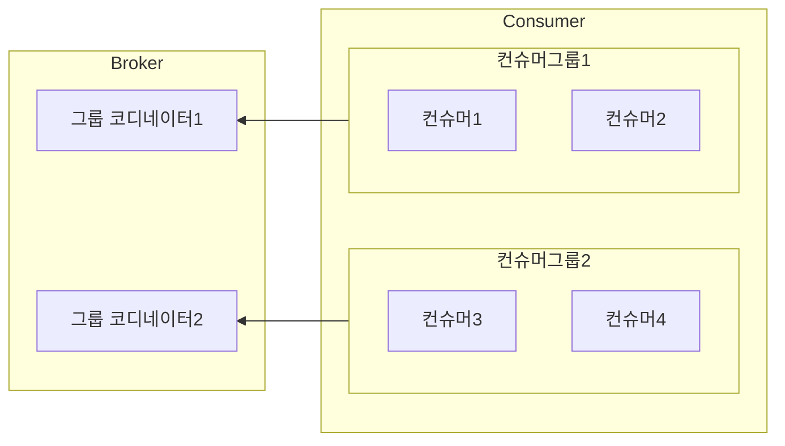
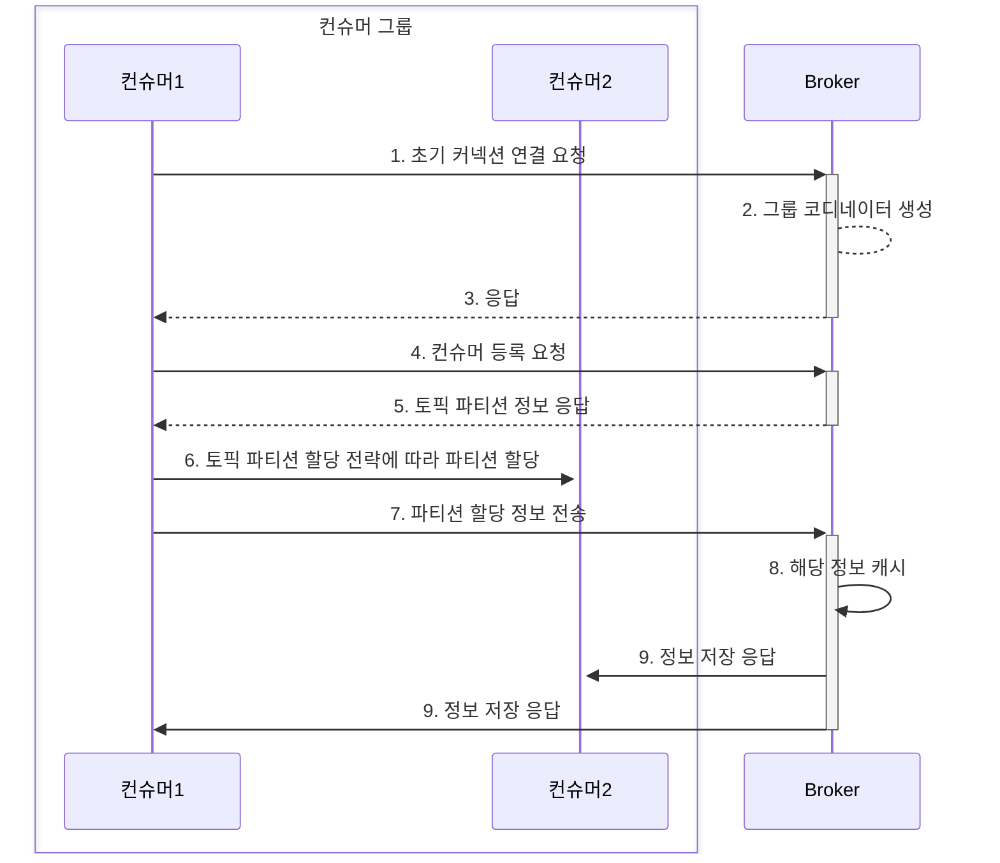

# 컨슈머의 내부 동작 원리

## 컨슈머 오프셋 관리

* 카프카에서는 메시지의 위치를 나타내는 것을 오프셋(offset)이라고 부름
* 컨슈머 그룹은 그룹별로 `__consumer_offsets` 토픽에 자신들의 오프셋 정보를 저장
  * 컨슈머 그룹, 토픽, 파티션 등의 내용을 통합해 기록
* 저장되는 오프셋 값은 컨슈머가 마지막으로 읽은 메시지의 위치가 아니라 다음으로 읽어야 할 메시지의 위치를 나타냄

## 그룹 코디네이터

* 컨슈머들은 하나의 컨슈머 그룹의 구성원으로 속하며, 컨슈머 그룹 내의 각 컨슈머들은 서로 자신의 정보를 공유함
* 컨슈머 그룹 내 맴버들의 변경 정보를 트래킹하기 위해 그룹 코디네이터를 카프카 브로커에 생성함
* 컨슈머 그룹별로 그룹 코디네이터를 생성함

### 컨슈머 그룹 등록 과정

* 컨슈머 설정값 `bootstrp.borkers` 리스트에 있는 브로커에게 컨슈머 클라이언트와 초기 커넥션을 연결하기 위한 요청 전송
* 그룹 코디네이터는 `group.initial.rebalance.delay.ms` 시간 동안 컨슈머의 요청을 기다림
* 가장 먼저 컨슈머 등록 요청을 보내는 컨슈머가 컨슈머 그룹의 리더가 됨

## 컨슈머 리밸런싱 

* 컨슈머가 재시작되면 엔티티 ID가 변경되어 컨슈머 그룹의 리밸런싱이 발생함
  * 리밸런싱이 일어나는 동안 모든 컨슈머가 정지하므로 잦은 리밸런싱은 성능에 영향을 미침
* 이를 방지하기 위해 **스태틱 맴버십**이라는 개념이 카프카 2.3버전부터 도입됨
  * 컨슈머 그룹 내에서 컨슈머가 재시작 등으로 그룹에서 나갔다가 다시 합류하더라도 리밸런싱이 일어나지 않음
  * 컨슈머마다 인식할 수 있는 ID를 사용하여 다시 합류 시에 그룹 코디네이터가 기존 구성원임을 인식할 수 있게함
  * 스태틱 맵버심 기능이 적용된 컨슈머는 컨슈머 그룹에서 떠날 대 그룹 코디네이터에게 알리지 않으므로 불필요한 리밸런싱도 발생하지 않음
  * 컨슈머 인스턴스별로 고유한 `group.instance.id` 값을 설정하여 스태틱 맴버십 적용
    * 스태틱 맴버십 사용 시 `session.timeout.ms` 값도 컨슈머 재시작 시작보다 큰 값으로 설정하여 불필요한 리밸런싱이 일어나는 것을 방지해야함

## 컨슈머 파티션 할당 전략

| 파티션 할당 전략                             | 설명                                                                                                                                              |
|---------------------------------------|-------------------------------------------------------------------------------------------------------------------------------------------------|
| RangeAssignor(레인지 전략)                 | 파티션 할당 전략의 기본값 1. 구독하는 토픽에 대한 파티션을 순서대로 나열 후 컨슈머를 순서대로 정렬 2. 전체 파티션를 컨슈머 수로 나눠서 각 컨슈머가 몇 개의 파티션을 할당해야하는지 계산 3. 앞에 컨슈머부터 차례대로 파티션 할당 |
| RoundRobinAssignor(라운드 로빈 전략)         | 파티션 할당 전략 중 가장 간단한 방법 1. 컨슘해야하는 모든 파티션과 컨슈머 그룹 내의 컨슈머를 나열 2. 라운드 로빈으로 하나씩 파티션과 컨슈머를 할당                                                  |
| StickyAssignor(스티키 전략)                | 최초의 배치 전략은 라운드 로빈과 흡사 리밸런싱이 일어 났을 때 컨슈머가 할당 되지 않은 파티션만 새로운 컨슈머에 할당                                                                          |
| CooperativeStickyAssignor(협력적 스티키 전략) | 두 번의 리밸런싱을 통해 다운타임을 최소화 하는 방법                                                                                                                   |

## 정확히 한 번 컨슈머 동작

* `ISOLATION_LEVEL_CONFIG` 옵션의 값을 `read_committed`로 설정하여 트랜잭션이 완료된 메시지만 읽을 수 있도록 변경할 수 있음
  * 기본값은 `read_uncommitted`로 모든 메시지를 읽을 수 있음
* **컨슈머는 프로듀서와 다르게 정확히 한 번만 가져오는 것은 아님**
  * 컨슈머는 트랜잭션 코디네이터와 통신하는 부분이 없기 때문에 정확하게 메시지를 한 번 가져오는지를 보장할 수 없음
  * 컨슈머에 의해 컨슘된 메시지가 다른 싱크 저장소로 중복 저장되는 가능성도 있음
* `sendOffsetsToTransaction` 메소드를 이용하여 컨슈머 그룹의 오프셋 커밋을 트랜잭션에 포함 시킬 수 있음
* 일부 컨슈머 애플리케이션에서 정확히 한 번을 지원하는 경우도 있음
