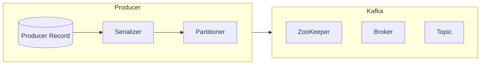

# 프로듀서의 내부 동작 원리

프로듀서가 전송하려는 메시지들은 프로듀서의 send( ) 메서드를 호출하면 시리얼라이저, 파티셔너를 거쳐 카프카로 전송된다. 

## 프로듀서의 배치

카프카는 프로듀서의 처리량을 높이기 위해 프로듀서 메모리에 메시지를 모았다가 전송하는 배치 전송 방식을 권장한다. 배치 전송을 위해 다음과 같은 옵션들을 제공한다.

* buffer.memory
  * 버퍼 메모리 옵션, 기본값은 32MB
  * batch.size 보다 큰 값으로 설정
    * 토픽 A가 3개의 파티션을 갖고 있고 batch.size는 기본값인 16KB라면 buffer.memory 사이즈는 최소 16KB * 3 보다 큰 값으로 설정
* batch.size
  * 배치 전송을 위해 메시지(레코드)들을 묶는 단위 크기를 설정하는 옵션, 기본값은 16KB
* linger.ms
  * 배치 전송을 위해 버퍼 메모리에서 대기하는 메시지들의 최대 대기시간을 설정하는 옵션, 단위는 밀리초(ms)이며 기본값은 0
  * 기본값 0으로 설정하면 배치 전송을 위해 기다리지 않고 메시지들을 즉시 전송

<p.155 그림 5-4 참고>

처리량을 높여서 처리해야 하는 상황인지 지연시간 없이 메시지를 전송해야 하는 상황인지에 따라 위 옵션 값을 조절해서 사용해야 한다.

## 파티셔너
* 카프카 토픽은 성능 향상을 위한 병렬 처리가 가능하도록 파티션으로 나뉨
* 프로듀서가 카프카로 전송한 메시지는 해당 토픽 내 각 피티션의 로그 세그먼트에 저장됨
* 프로듀서는 카프카로 메시지를 전송할 때 해당 토픽의 어느 파티션으로 메시지를 보낼 지 결정해야 하는데 이 역할을 하는 것이 파티셔너임
* 기본적으로 메시지 키를 해시 처리해 파티션을 구하는 방식을 사용함
* 메시지 키 값이 같으면 모두 같은 파티션으로 전송됨
* 메시지 키는 꼭 필요한 경우가 아니면 사용하지 않는 것이 좋음
* 토픽의 파티션 수가 바뀌면 해쉬 알고리즘을 통해 매핑되는 파티션이 바뀌됨
* 동일한 키를 사용하는 메시지가 다른 파티션에 할당되어 관리자가 의도하지 않은 방식으로 메시지가 전송될 수 있음

### 라운드 로빈 전략

* 별도의 레코드 키값을 지정하지 않고 메시지를 전송할 경우 사용되는 방식으로 라운드 로빈 알고리즘을 사용해 목적지 토핑의 파티션들로 레코드들을 랜덤 전송
* 배치 처리를 하는 경우 비효율적인 상황이 발생할 수 있음
  * 토픽 A의 파티션이 3개이고 각 파티션별로 배치 전송을 위해 필요한 레코드 수가 3일 때, 필요한 레코드 수를 다 채우지 못한 파티션은 카프카로 메시지를 전송하지 않아 지연시간이 늘어날 수 있음
  * 관리자는 특정 시간을 초과하면 메시지를 전송하도록 설정할 수 있으나 배치와 압축의 효과를 누리지 못할 수 있음 

### 스티키 전략

* 라운드 로빈 전략이 가지고 있는 지연시간이 증가되는 단점을 개선하고자 2019년 아파치 카프카 2.4 버전부터 출시된 전략
* 하나의 파티션에 레코드 수를 먼저 채워서 카프카로 빠르게 배치 전송하는 전략
* 카프카로 전송하는 메시지의 순서가 그다지 중요하지 않은 경우라면 스티키 파티셔닝 전략 사용을 권장 

## 시리얼라이저

내용 없음

## 메시지 전송 방식

* 적어도 한 번 전송(at-least-once)
* 최대 한 번 전송(at-most-once)
* 정확히 한 번 전송(exactly-once)
* 중복 없는 전송

그림 추가 필요