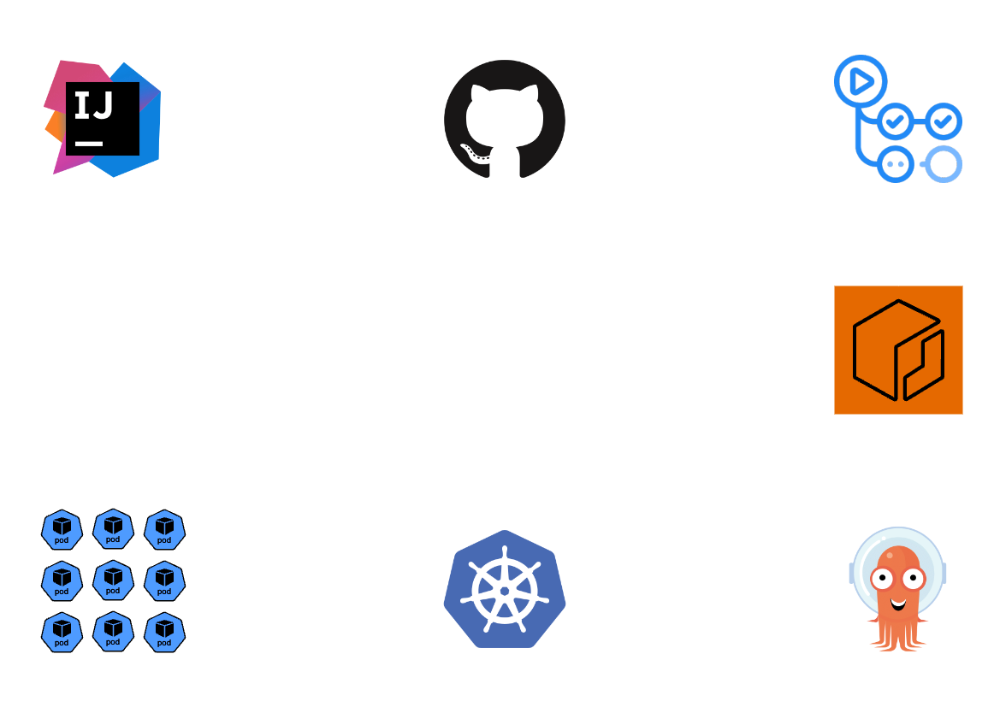

# 11장 애플리케이션 개발: 개발 워크플로우와 CI/CD

## Docker 기반 개발자 워크플로우 vs PaaS 기반 개발자 워크플로우

### Docker 기반 워크플로우
모든 환경에서 도커 또는 쿠버네티스가 사용되며, 개발자 역시 로컬 PC에 전용 클러스터를 구축하여 사용하는 방식

- Dockerfile 스크립트 작성
- 작성한 Dockerfile을 사용하여 Docker Image 생성 (docker build)
- Docker Image를 Dokcer Hub나 Private Local Repository에 업로드 (docker push) - optional
- 쿠버네티스 매니페스트 파일을 작성할 때 위에서 생성한 이미지를 사용
  - 로컬 이미지와 레지스트리에서 내려받은 이미지를 모두 사용할 수 있음
  - 이미지 태그가 명시적으로 지정되지 않았다면 쿠버네티스는 무조건 이미지 내려받기를 먼저 시도
  - 이 규칙을 바꾸려면 이미지 내려받는 정책을 오버라이드 하면 됨
- 작성한 쿠버네티스 매니페스트 파일을 통해 쿠버네티스 클러스터에 애플리케이션 배치 (kubectl apply)

#### 장점
- **유연성**: 의존 모듈을 원하는 대로 Dockerfile 스크립트에 추가할 수 있음.
- **확장성**: 컨테이너화를 통해 서비스 확장이 용이하며, 여러 컨테이너를 관리하는 오케스트레이션 도구(Kubernetes 등)를 통해 확장성을 극대화할 수 있음.
- **기술 스택 제약 없음**: 어떤 언어나 프레임워크든 사용 가능하며, 자유롭게 설정 가능.

#### 단점
- **복잡성**: 컨테이너 이미지 관리, 네트워크 구성, 스토리지 관리 등 인프라 관리에 대한 복잡성이 있음.
- **학습 곡선**: 도커와 관련된 도구(Kubernetes 등)를 사용하는 데 있어 학습 곡선이 있음.

---

### PaaS 기반 워크플로우
운영 환경과 테스트 환경은 CI/CD 플랫폼을 제공하는 서비스를 사용하고, 개발자는 도커 없이 애플리케이션 컴포넌트를 직접 실행하는 방식

- 개발자는 컨테이너를 이용하지 않고 작업하여 변경사항을 깃 서버에 푸시
- 빌드 절차는 깃 서버를 주시하다가 새로운 변경이 푸시되면 빌드 파이프라인을 실행
- 빌드 파이프라인에서는 도커나 빌드팩 등을 사용하여 이미지를 빌드
- 생성된 이미지는 레지스트리에 푸시
- 레지스트리에 푸시된 이미지를 다운 받아 클러스터에 애플리케이션 배치

#### 장점
- **간편함**: 인프라 관리를 신경 쓸 필요 없이 애플리케이션 개발에만 집중 가능.
- **자동화된 확장성**: 대부분의 PaaS 플랫폼에서 자동 확장 기능을 제공하여 트래픽 변화에 따른 서버 자원 관리가 용이.
- **통합 도구**: 배포, 모니터링, 로그 관리 등의 기능을 쉽게 통합할 수 있는 다양한 도구 제공.
- **빠른 배포**: 미리 준비된 환경에서 빠르게 애플리케이션을 배포할 수 있음.
- **보안**: 인프라 레벨의 보안 및 패치 관리를 PaaS 제공자가 담당하므로 개발자는 보안에 덜 신경 써도 됨.

#### 단점
- **제한된 유연성**: PaaS 플랫폼에서 제공하는 기능 외의 특수한 요구 사항에 대한 제약이 있을 수 있음.
- **비용**: 트래픽과 자원 사용량이 많을 경우 비용이 빠르게 증가할 수 있음.
- **벤더 종속성**: 특정 PaaS 플랫폼에 종속될 경우, 플랫폼 변경 시 높은 마이그레이션 비용 발생 가능.
- **기술 스택 제한**: 지원하는 언어나 프레임워크에 대한 제한이 있을 수 있음.

---

### 결론
- **Docker 기반 워크플로우**는 **유연성과 이식성**이 강점인 반면, 관리 복잡성이 증가할 수 있음.
- **PaaS 기반 워크플로우**는 **간편함과 자동화**에 강점이 있지만, 특정 플랫폼에 종속될 수 있고 유연성이 부족할 수 있음.
- **선택 기준**은 팀의 기술 역량, 프로젝트의 복잡성, 비용 효율성에 따라 달라짐.
  - 전체 기술 스택을 컨테이너로 사용하지 않고 필요한 부분에만 적용하는 것도 가능
  - 도커와 쿠버네티스 학습은 앞으로 무슨 일을 하든지 도움이 됨
