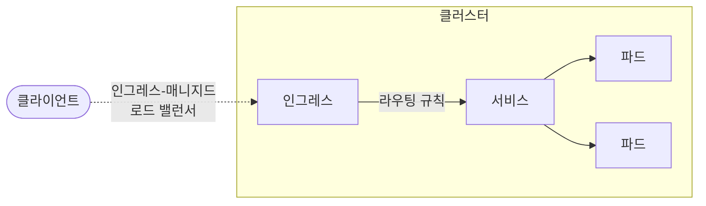
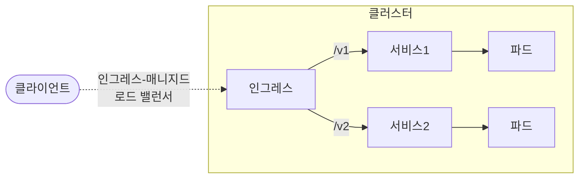

# 15장 인그레스를 이용한 인입 트래픽 관리

* `인그레스(Ingress)`는 클러스터 외부에서 내부 서비스로 접근하는 HTTP, HTTPS 요청들을 어떻게 처리할지 정의해둔 규칙들의 모음
* 클러스터 외부에서 접근가능한 URL을 사용할 수 있게 하며, 트래픽을 로드밸런싱도 해주고, SSL 인증서 처리를 해주고, 도메인 기반으로 가상 호스팅을 제공하기도 함
* 인그레스가 작동하려면, `인그레스 컨트롤러(Ingress Controller)`가 실행되고 있어야 함
* 인그레스 컨트롤러는 클러스터와 함께 자동으로 실행되지 않으며 클러스터에 가장 적합한 컨트롤러를 선택하여 구현해야 함
* 쿠버네티스에서 지원하는 프로젝트로는 AWS, GCE, Nginx 인그레스 컨트롤러가 있음
  * [추가 컨트롤러](https://kubernetes.io/ko/docs/concepts/services-networking/ingress-controllers/)는 공식 문서를 참고



## 인그레스 컨트롤러 설치

Ingress-Nginx Controller 설치
```shell
kubectl apply -f https://raw.githubusercontent.com/kubernetes/ingress-nginx/controller-v1.12.0-beta.0/deploy/static/provider/cloud/deploy.yaml
```

Ingress-Nginx Controller 설치 확인
```shell
kubectl get all -n ingress-nginx
```

ingress.yaml
```shell
apiVersion: networking.k8s.io/v1 # networking.k8s.io/v1beta1는 v1.22부터 Deprecated 
kind: Ingress
metadata:
  name: hello-kiamol
  labels:
    kiamol: ch15
spec:
  # 생락하려면 기본 인그레스 클래스가 정의 되어 있어야 함
  # 기본 인그레스 클래스 없이 ingressClassName 속성 누락 시 인그레스가 무시처리 됨
  # "Ignoring ingress because of error while validating ingress class" ingress="default/hello-kiamol" error="ingress does not contain a valid IngressClass"
  ingressClassName: nginx 
  rules:
  - http:
      paths:
      - path: /
        pathType: Prefix
        backend:
          service:
            name: hello-kiamol
            port:
              number: 80
```

service.yaml
```yaml
apiVersion: v1
kind: Service
metadata:
  name: hello-kiamol
  labels:
    kiamol: ch15
spec:
  ports:
    - port: 80
      targetPort: http
  selector:
    app: hello-kiamol
  type: ClusterIP
```

deployment.yaml
```yaml
apiVersion: apps/v1
kind: Deployment
metadata:
  name: hello-kiamol
  labels:
    kiamol: ch15
spec:
  selector:
    matchLabels:
      app: hello-kiamol
  template:
    metadata:
      labels:
        app: hello-kiamol
    spec:
      containers:
        - name: web
          image: kiamol/ch02-hello-kiamol
          ports:
            - containerPort: 80
              name: http
```

## 인그레스 규칙을 이용한 HTTP 트래픽 라우팅

* 하나의 인그레스에 여러개의 서비스를 매핑 시켜서 경로에 따라 트래픽을 라우팅 시킬 수 있음
* 라우팅 규칙의 적용 범위를 특정 도메인에 대한 요청으로 제한 할 수 있음



ingress.yaml

```yaml
apiVersion: networking.k8s.io/v1
kind: Ingress
metadata:
  name: vweb
  labels:
    kiamol: ch15
  annotations:
    nginx.ingress.kubernetes.io/rewrite-target: /
spec:
  ingressClassName: nginx
  rules:
    - host: kubernetes.docker.internal # 라우팅 규칙의 적용 범위를 특정 도메인에 대한 요청으로 제한
      http:
        paths:
          - path: /
            pathType: Prefix
            backend:
              service:
                name: vweb-v2
                port:
                  number: 80
          - path: /v1
            pathType: Prefix
            backend:
              service:
                name: vweb-v1
                port:
                  number: 80
          - path: /v2
            pathType: Prefix
            backend:
              service:
                name: vweb-v2
                port:
                  number: 80
```

#### 참고자료
https://gustjd887.tistory.com/49  
https://kubernetes.github.io/ingress-nginx/deploy/
