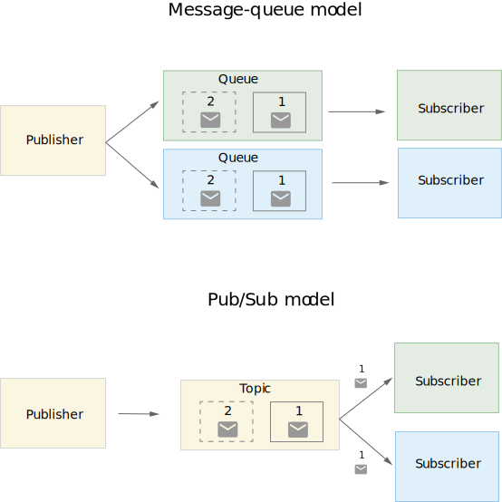

# 레디스를 메시지 브로커로 사용하기

`메시지 브로커(Message Broker)`는 애플리케이션, 시스템 및 서비스가 서로 간에 통신하고 정보를 교환할 수 있도록 해주는 소프트웨어를 말합니다. 메시지 브로커는 두 개의 기본 메시지 배포 패턴을 제공합니다.

- `포인트-투-포인트 메시징` : 메시지의 송신자와 수신자가 일대일 관계인 메시지 큐에서 사용되는 배포 패턴입니다. 각 메시지는 하나의 수신자에게만 전송되며, 한 번만 이용됩니다. 이는 주로 한 번만 실행되어야 하는 경우에 사용됩니다. 예를 들어, 급여 및 재무 트랜잭션 처리 등이 포함됩니다.
- `발행/구독 메시징`: 메시지의 생성자가 토픽에 발행하고, 다수의 메시지 이용자가 메시지를 수신하고 싶은 토픽을 구독하는 배포 패턴입니다. 한 토픽에 발행된 모든 메시지는 이를 구독한 모든 애플리케이션에 배포됩니다. 이는 일대다 관계가 형성되며, 주로 브로드캐스트 스타일의 배포 방법으로 사용됩니다. 예를 들어, 항공사에서 항공편의 착륙 시간이나 지연 상태에 관한 업데이트를 배포할 때 사용됩니다.



## 메시지 보증 전략

메시징 시스템에서는 다음과 같은 세 가지의 메시지 보증 전략을 갖추고 있습니다. 애플리케이션 특성에 따라 해당 전략을 적절히 사용해야 합니다.

- `at most once`: 메시지를 최소 한 번 보내는 것을 의미합니다. 레디스에서는 소비자가 메시지를 받자마자 ACK를 전송하여 응답 속도를 향상시킬 수 있습니다. 메시지를 처리하는 과정에서 소비자에 장애가 발생하면 메시지 유실이 발생할 수 있습니다.
- `at least once`: 메세지 전송에 대해 최소 1번 처리할 것을 보장한다는 의미입니다. 모든 메시지에 대한 처리를 완료하고 ACK를 반환합니다. 메시지 처리는 완료했지만 ACK를 보내기 직전에 소비자에 장애가 발생했다가 복구될 경우 메시지를 중복처리하게 되는 경우가 있을 수도 있습니다. 
- `exactly once`: 모든 메시지가 무조건 한 번씩 전성되는 것을 보장한다는 의미입니다.

## List를 메시징 큐로 사용하기

`LPUSH`, `LPOP`, `RPUSH`, `RPOP` 커맨드를 사용하여 애플리케이션 특성에 맞는 메시징 큐를 직접 구현할 수 있습니다. `BLPOP`, `BRPOP` 커맨드를 통해 블로킹 기능을 활용할 수 있습니다.

```shell
# queue:a에 5초 동안 대기하고, 5초가 경과하면 nil을 반환
> BRPOP queue:a 5
(nil)
(5.04s)

# queue:a에 1000초 동안 대기하고, 1000초가 경과하면 nil을 반환
# 19.01s 동안 리스트에 데이터가 입력되는 것을 기다리다가 신규로 들어온 값을 반환함
> BRPOP queue:a 1000
1) "queue:a"
2) "hello"
(19.01s)

# queue:a에 타임아웃을 0으로 설정하여 데이터가 들어올 때까지 대기
> BRPOP queue:a 0
1) "queue:a"
2) "hi"
(11.84s)

# RPOPLPUSH 커맨드를 사용해 원형 큐를 구현
> LPUSH clist a b c
(integer) 3

> LRANGE clist 0 -1
1) "c"
2) "b"
3) "a"

> RPOPLPUSH clist clist
"a"

> LRANGE clist 0 -1
1) "a"
2) "c"
3) "b"
```

## Pub/Sub

`PUBLISH`, `SUBSCRIBE` 커맨드를 사용하여 발행/구독 메시징 패턴을 구현할 수 있습니다. 레디스 노드에 접근할 수 있는 모든 클라이언트는 발해자와 구독자가 될 수 있습니다. 발행자는 특정 채널에 메시지를 보낼 수 있으며, 구독자는 특정 채널을 리스닝하다가 메시지를 읽어갈 수 있습니다.

레디스에서는 최소한의 메시지 전달 기능만 제공합니다. 발행자는 메시지를 채널로 보낼 수 있을 뿐, 어떤 구독자가 메시지를 읽어가는지, 정상적으로 모든 구독자에게 메시지가 전달됐는지 확인할 수 없습니다. 구독자는 해당 메시지가 언제 어떤 발행자에 의해 생성됐는지 등의 메타데이터는 알 수 없습니다.

한 번 전파된 데이터는 레디스에 저장되지 않기 때문에 특정 구독자에 장애가 생겨 메시지를 받지 못했더라도 그 사실을 알 수가 없기 때문에 정합성이 중요한 데이터를 전달하기에는 적합하지 않습니다.

```shell
# 메시지를 발행하는 시점에 구독자가 없는 경우 해당 메시지는 손실됨
> publish pub-sub-demo hello
(integer) 0

# 메시지를 수신한 구독자 수를 반환
> publish pub-sub-demo kks
(integer) 3

(subscribed mode)> 
1) "message"
2) "pub-sub-demo"
3) "kks"
```

레디스 클러스터 구조에서도 pub/sub을 사용할 수 있습니다. 메시지를 발행하면 해당 메시지는 클러스터에 속한 모든 노드에 자동으로 전달됩니다. 따라서 레디스 클러스터의 아무 노드에 연결해 SUBSCRIBE 커맨드를 사용하면 데이터를 수신할 수 있습니다. 이 방식은 불필요한 레디스 노드에 메시지가 복제되어 불필요한 리스소 사용과 네트워크 부하 문제를 발생시킬 수 있습니다.

위 문제를 해결하기 위해 레디스 7.0에서는 sharded pub/sub 기능이 도입되었습니다. 클러스터에서 키가 슬롯에 할당되는 것과 동일한 방식으로 채널이 할당되며, 같은 슬롯을 가지고 있는 노드 간에만 pub/sub 메시지를 전파합니다. `SPUBLISH`, `SSUBSCRIBE` 커맨드를 활용하여 sharded pub/sub 기능을 사용할 수 있습니다.

## Stream

레디스 5.0에서 새로 추가된 자료 구조로 대용량, 대규모의 메시징 데이터를 빠르게 처리할 수 있도록 설계됐다. 데이터를 계속 추가하는 방식으로 저장되는(append-only) 자료 구조다.

stream에서 각 메시지는 유니크한 ID를 가지며, 이 값은 중복되지 않는다. ID는 다음과 같이 2개의 파트로 나뉜다.

```shell
<millisecondsTime>-<sequenceNumber>
```

밀리세컨드 파트는 stream에 아이템이 저장될 시점의 레디스 노드 로컬 시간입니다. 시퀀스 파트는 동일한 밀리세컨드 시간에 여러 아이템이 저장될 수 있으므로, 같은 밀리세컨드의 저장된 데이터의 순서를 의미합니다. 시퀀스 번호는 64bit를 사용합니다.

### 데이터 생성

`XADD` 커맨드를 이용해 새로운 이름의 stream을 생성할 수 있습니다. `*`는 메시지 ID를 레디스에서 자동 생성되는 타임스탬프 ID를 사용함을 의미합니다.   
```shell
# XADD key entryID field value field value
# entryId에 *을 사용할 경우 
> XADD email * subject "first" body "hello?"
"1711366982828-0"
```

메시지 ID는 수동으로 설정할 수 있습니다. 최초 생성한 값보다 작은 값은 사용할 수 없습니다.

```shell
> XADD mystream 0-1 "hello" "world"
"0-1"

> XADD mystream 0-2 "hi" "redis"
"0-2"

> XADD mystream 0-0 "kafak" "best"
(error) ERR The ID specified in XADD must be greater than 0-0
```

### 데이터 조회

`XREAD` 커맨드를 사용하여 데이터를 조회할 수 있습니다. `BLOCK` 키워드를 사용하면 새로운 메시지가 들어올 때까지 리스닝하면서 기다리도록 할 수 있습니다. 메시지 ID를 이용해 필요한 데이터를 검색하는 방식도 가능합니다.

```shell
# BLOCK 키워드 사용 시 읽을 수 있는 메시지가 있다면 옵션이 무시됨
> XREAD BLOCK 10000 STREAMS email 0
1) 1) "email"
   2) 1) 1) "1711366982828-0"
         2) 1) "subject"
            2) "first"
            3) "body"
            4) "hello?"
      2) 1) "1711367367273-0"
         2) 1) "subject"
            2) "second"
            3) "body"
            4) "hi?"
      3) 1) "1711367927632-0"
         2) 1) "subject"
            2) "third"
            3) "body"
            4) "newval"
            
# 정상적으로 BLOCK 옵션이 적용되 10초만에 메시지를 받음 
> XREAD BLOCK 0 STREAMS email "1711367927632-0"
1) 1) "email"
   2) 1) 1) "1711368161293-0"
         2) 1) "subject"
            2) "fourth"
            3) "body"
            4) "newval2"
(10.09s)

# 지정한 시간 동안 메시지를 받지 못하면 null을 반환함
> XREAD BLOCK 100 STREAMS email "1711368161293-0"
(nil)

# 지정한 메시지 ID보다 큰 값을 가지는 메시지를 읽을 수 있음
> XREAD BLOCK 0 STREAMS email 0 "1711366982828-0"
(error) ERR Unbalanced 'xread' list of streams: for each stream key an ID or '$' must be specified.

> XREAD BLOCK 0 STREAMS email 1711367927632
1) 1) "email"
   2) 1) 1) "1711368161293-0"
         2) 1) "subject"
            2) "fourth"
            3) "body"
            4) "newval2"
      2) 1) "1711368161293-1"
         2) 1) "subject"
            2) "fifth"
            3) "body"
            4) "kafka"
```

`XRANGE` 커맨드를 이용하여 원하는 시간대의 데이터를 조죄할 수 있습니다. `XADD` 커맨드와 달리 데이터를 반환한 뒤 종료됩니다.

```shell
# stream에 저장된 모든 데이터 조회
> XRANGE email - +
1) 1) "1711366982828-0"
   2) 1) "subject"
      2) "first"
      3) "body"
      4) "hello?"
2) 1) "1711367367273-0"
   2) 1) "subject"
      2) "second"
      3) "body"
      4) "hi?"
      
# 메시지가 저장된 특정 시점을 조회
> XRANGE email 1711366982828 1711366982829
1) 1) "1711366982828-0"
   2) 1) "subject"
      2) "first"
      3) "body"
      4) "hello?"
      
# 입력한 데이터를 포함하지 않고 조회하고 싶을 때는 ( 를 사용
> XRANGE email (1711366982828 1711367367273
1) 1) "1711367367273-0"
   2) 1) "subject"
      2) "second"
      3) "body"
      4) "hi?"
```

### 소비자와 소비자 그룹

같은 데이터를 여러 소비자에게 전달하는 것을 팬아웃(fan-out)이라고 합니다. 레디스에서도 `XREAD` 커맨드를 여러 소비자에서 실행하면 팬아웃이 가능합니다.

`XGROUP`, `XREADGROUP` 커맨드로 소비자 그룹을 생성하고 병렬로 메시지를 처리하여 성능을 향상 시킬 수 있습니다. 소비자 그룹 안에 한 소비자는 다른 소비자가 아직 읽지 않은 데이터만을 읽을 수 있습니다.

```shell
# emailServiceGroup 소비자 그룹 생성 
> XGROUP CREATE email emailServiceGroup $
OK

# emailServiceGroup es1 소비자를 통해 메시지를 가져옴
# 소비할 메시지가 없을 경우 null 반환
> XREADGROUP GROUP emailServiceGroup es1 COUNT 1 STREAMS email >
(nil)
```

### ACK와 보류 리스트

소비자 그룹에 속한 소비자가 메시지를 읽어가면 각 소비자별로 읽어간 메시지에 대한 리스트(pending list)를 새로 생성하며, 마지막으로 읽어간 데이터의 ID로 last_delivered_id 값을 업데이트한다. last_delivered_id 값은 해당 소비자 그룹에 마지막으로 전달한 ID가 무엇인지를 파악해 동일한 메시지를 중복으로 전달하지 않기 위해 사용됩니다. 소비자에서 stream 쪽으로 데이터 처리가 완료 됐다는 뜻으로 ACK를 보내면 pending list에서 해당 메시지를 삭제합니다.

`XPENDING` 커맨드로 소비자 그룹에서 보류 중인 리스트가 있는지 확인할 수 있습니다. `XACK` 커맨드로 메시지를 처리 했다고 응답을 보낼 수 있습니다.

```shell
> XPENDING email emailServiceGroup
1) (integer) 1       // ACK를 받지 못해 보류 중인 메시지의 개수
2) "1711371476614-0" // 보류 중인 메시지 ID의 min
3) "1711371476614-0" // 보류 중인 메시지 ID의 max
4) 1) 1) "es1"       // 소비자별로 보류 중인 메시지 개수
      2) "1"
       
> XACK email emailServiceGroup 1711371476614-0
(integer) 1

> XPENDING email emailServiceGroup
1) (integer) 0
2) (nil)
3) (nil)
4) (nil)
```

### 메시지 재할당

소바자에게 장애가 날 경우 `XCLAIM` 커맨드를 사용해 메시지를 다른 소비자에게 할당할 수 있습니다. `XCLAIM` 사용 시 최소 대기 시간(min-idle-time)을 지정합니다. 메시지가 보류 상태로 머무른 시간이 최소 대기 시간을 초과한 경우에만 소유권을 변경할 수 있도록 하고 다른 소비자에게 메시지가 할당됨과 동시에 메시지 보류 시간을 0으로 재설정하여 다른 소비자에게 중복해서 할당되는 것을 방지합니다.

```shell
# es3 소비자에 있는 1711371476614-0 메시지를 커맨드를 입력하는 소비자에게 재할당
> XCLAIM email emailServiceGroup es3 360 1711371476614-0
```

`XAUTOCLAIM` 커맨드를 사용하여 최소 대기 시간을 만족하는 보류 중인 메시지를 지정한 소비자에게 재할당 할 수 있습니다. 재할당할 메시지를 지정하지 않아도 되기 때문에 간단하게 메시지의 재할당이 가능합니다.

```shell
> XAUTOCLAIM email emailServiceGroup es2 360 0-0 count 1
```

stream 내부의 각 메시지는 counter라는 값을 가지고 있습니다. `XREADGROUP`을 이용해 소비자에게 할당하거나 `XCLAIM`로 재할당할 경우 1씩 증가합니다. 계속 처리되지 못하는 메시지는 counter가 특정 값에 도달할 경우 dead letter로 보내는 설정을 통해 나중에 모아서 처리하는 방법도 지원합니다.

`XINFO` 커맨드를 사용하여 stream의 상태를 확인할 수 있습니다.
```shell
> XINFO consumers email emailServiceGroup
1) 1) "name"
   2) "es1"
   3) "pending"
   4) (integer) 0
   5) "idle"
   6) (integer) 2456842
   7) "inactive"
   8) (integer) 2456842
```

##### Reference
- [Message Brokers](https://www.ibm.com/kr-ko/topics/message-brokers)
- [Event-driven architecture with Pub/Sub](https://cloud.google.com/solutions/event-driven-architecture-pubsub)