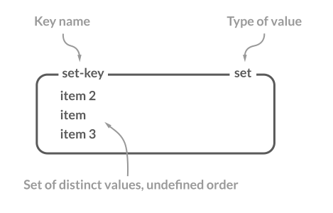

# 레디스의 자료 구조

- [Strings](#strings)
- [Lists](#lists)
- [Hashes](#hashes)
- [Sets](#sets)
- [Sorted sets](#sorted-sets)
- [Bitmaps](#bitmaps)
- [HyperLogLog](#hyperloglog)
- [Geospatial indexes](#geospatial-indexes)
- [Streams](#streams)

## Strings

- 레디스에서 데이터를 저장할 수 있는 가장 간단한 자료 구조
- 최대 512MB의 문자열 데이터를 저장할 수 있음
- 이진 데이터를 포함하는 모든 종류의 문자열이 binary-safe하게 처리됨
  - JPEG 이미지와 같은 바이트 값, HTTP 응답값 등의 데이터를 저장하는 것도 가능


#### Binary-safe 란?

"Binary-safe"는 이진 데이터를 문자열로 안전하게 처리하는 것을 의미합니다. 레디스에서는 문자열 자료형을 통해 바이트 배열로 데이터를 저장하고 반환하여 이를 실현합니다. 클라이언트가 이진 데이터를 레디스에 저장하면 추가적인 처리 없이 안전하게 보존됩니다.

### 기본 명령어

* **SET** - 데이터를 저장
  * NX 옵션: 지정한 키가 없을 때에만 새로운 키를 저장, 락 구현 시 유용함
  * XX 옵션: 지정한 키가 있을 때에만 새로운 값으로 저장, 새로운 키를 생성 X
* **GET** - 데이터를 조회
* **INCR** - 숫자를 원자적(atomic)으로 증가
  * 같은 키에 접근하는 여러 클라이언트가 경쟁 상태(race condition)를 발생시킬 일이 없음을 의미
* **INCRBY** - 숫자를 원하는 만큼 증가 
* **DECR** - 숫자를 감소
* **DECRBY** - 숫자를 원하는 만큼 감소
* **MSET** - 한 번에 여러 키를 저장
* **MGET** - 한 번에 여러 키를 조회

```shell
> set hello world
OK

> get hello
"world"

> set hello newval NX
(nil)

> get hello
"world"

> set hi newval2 XX
(nil)

> get hi
(nil)

> mset a 10 b 20 c 30
OK

> mget a b c
1) "10"
2) "20"
3) "30"
```

## Lists

* 순서를 가지는 문자열의 목록
* 하나의 list에는 최대 42억여 개의 아이템을 저장할 수 있음
* Linked Lists를 통해 구현되어 있어 있어 리스트 맨 앞이나 맨 뒤에 아이템을 추가할 때는 일정한 시간으로 수행됨
* 인덱스를 이용해 데이터에 직접 접근할 수 있지만 속도가 느림
  * 큰 집합에서 중간 값에 빠른 접근이 필요할 때는 Sorted sets을 사용할 것


### 기본 명령어

* **LPUSH** - list의 왼쪽에 데이터를 추가
* **RPUSH** - list의 오른쪽에 데이터를 추가
* **LRANGE** - list에 들어 있는 데이터를 조회
  * 시작과 끝 아이템의 인덱스를 각각 인수로 받아 출력
  * 가장 오른쪽(tail)에 있는 아이템의 인덱스는 -1, 그 앞의 인덱스는 -2
  * 0부터 -1까지의 아이템을 출력하라는 것은 전체 데이터를 출력하라는 의미
* **LPOP** - list에 저장된 첫 번째 아이템을 반환하는 동시에 list에서 삭제
  * 숫자와 함께 사용하면 지정한 숫자만큼의 아이템을 반복해서 반환
* **LTRIM** - 시작과 끝 아이템의 인덱스를 인자로 받아 지정한 범위에 속하지 않는 아이템은 모두 삭제, LPOP과 같이 삭제되는 아이템을 반환하지는 않음
* **LINSERT** - 원하는 데이터의 앞이나 뒤에 데이터를 추가 
  * BEFORE, AFTER 옵션을 활용
  * 지정한 데이터가 없으면 오류를 반환
* **LSET** - 지정한 인덱스의 데이터를 신규 입력하는 데이터로 변경
* **LINDEX** - 원하는 인덱스의 데이터를 확인

```shell
> LPUSH mylist E
(integer) 1

> RPUSH mylist B
(integer) 2

> LPUSH mylist D A C B A
(integer) 7

> LRANGE mylist 0 -1
1) "A"
2) "B"
3) "C"
4) "A"
5) "D"
6) "E"
7) "B"

> LRANGE mylist 0 3
1) "A"
2) "B"
3) "C"
4) "A"

### LPOP
> LPOP mylist
"A"

> LPOP mylist 3
1) "B"
2) "C"
3) "A"

### LTRIM
> LRANGE mylist 0 -1
1) "D"
2) "E"
3) "B"

> LTRIM mylist 0 1
OK

> LRANGE mylist 0 -1
1) "D"
2) "E"

### LINSERT
> LRANGE mylist 0 -1
1) "C"
2) "A"
3) "D"
4) "E"

> LINSERT mylist BEFORE A B
(integer) 5

> LRANGE mylist 0 -1
1) "C"
2) "B"
3) "A"
4) "D"
5) "E"

### LSET
> LRANGE mylist 0 -1
1) "C"
2) "B"
3) "A"
4) "D"
5) "E"

> LSET mylist 0 F
OK

> LRANGE mylist 0 -1
1) "F"
2) "B"
3) "A"
4) "D"
5) "E"

### LINDEX
> LRANGE mylist 0 -1
1) "F"
2) "B"
3) "A"
4) "D"
5) "E"

> LINDEX mylist 3
"D"
```

## Hashes

* 필드-값 쌍을 가진 아이템의 집합
  * 하나의 hash는 4,294,967,295개의 필드-값 쌍을 가질 수 있음
* 필드는 하나의 hash 내에서 유일하며, 필드와 값 모두 문자열 데이터로 저장됨
* 각 아이템마다 다른 필드를 가질 수 있으며, 동적으로 다양한 필드를 추가할 수 있음


### 기본 명령어

* **HSET** - 데이터 저장, 한 번에 여러 필드-값 쌍을 저장할 수 있음
* **HGET** - 데이터 조회, hash 자료 구조의 키와 아이템의 필드를 함께 입력
* **HMGET** - 하나의 hash 내에서 다양한 필드의 값을 조회
* **HGETALL** - 하나의 hash 내의 모든 필드-값 쌍을 차례로 반환

```shell
> HSET Product:123 Name "Happy Hacking"
(integer) 1

> HSET Product:123 TypeID 35
(integer) 1

> HSET Product:123 Version 2022
(integer) 1

> HSET Product:234 Name "Track Ball" TypeID 32
(integer) 2

> HGET Product:123 TypeID
"35"

> HMGET Product:234 Name TypeID 
1) "Track Ball"
2) "32"

> HGETALL Product:234
1) "Name"
2) "Track Ball"
3) "TypeID"
4) "32"
```

## Sets

* 정렬되지 않은 문자열의 모음
* 하나의 set 내에서 아이템은 중복해서 저장되지 않음
* SADD, SREM, SPOP 명령어는 O(1)의 시간복잡도를 갖지만 SMEMBERS는 O(n)의 시간복잡도를 가지고 있어서 사용 시 주의해야함
  * SSCAN 명령어 사용을 고려할 것
* 메모리 사용량이 걱정될 때는 Bloom filter 또는 Cuckoo filter 사용을 고려할 것



#### Bloom filter

레디스의 Bloom Filter는 확률적인 멤버십 질의를 위한 데이터 구조로, 고정된 크기의 비트 배열과 해시 함수를 사용하여 요소의 존재 여부를 빠르게 확인합니다. 이는 대량의 데이터에서 소량의 데이터를 빠르게 검색하는 데 유용하며, False Positive의 가능성이 있지만 False Negative는 발생하지 않습니다.

### 기본 명령어

* **SADD** - 데이터 저장, 한 번에 여러 개의 아이템을 저장할 수 있음
* **SMEMBERS** - set에 저장된 전체 아이템을 출력, 저장 순서와 관계 없음
* **SREM** - 특정 아이템을 삭제
* **SPOP** - 아이템을 랜덤으로 하나 반환하고 set에서 삭제
* **SINTER** - set에서 아이템들의 교집합
* **SUNION** - 합집합
* **SDIFF** - 차집합
* **SCARD** - 특정 키에 저장된 데이터의 개수를 반환

```shell
> SADD myset A
(integer) 1

> SADD myset A A A B B C D D E E F F F G
(integer) 6

> SMEMBERS myset
1) "A"
2) "B"
3) "C"
4) "D"
5) "E"
6) "F"
7) "G"

### SREM, SPOP
> SREM myset B
(integer) 1

> SPOP myset
"C"

> SMEMBERS myset
1) "A"
2) "D"
3) "E"
4) "F"
5) "G"

### SINTER, SUNION, SDIFF
> SADD set:111 A B C D E
(integer) 5

> SADD set:222 D E F G H
(integer) 5

> SINTER set:111 set:222
1) "D"
2) "E"

> SUNION set:111 set:222
1) "A"
2) "B"
3) "C"
4) "D"
5) "E"
6) "F"
7) "G"
8) "H"

> SDIFF set:111 set:222
1) "A"
2) "B"
3) "C"

> SDIFF set:222 set:111
1) "F"
2) "G"
3) "H"

> SADD set:333 G
(integer) 1

> SDIFF set:222 set:111 set:333
1) "F"
2) "H"
```

## Sorted sets

* 스코어(score) 값에 따라 정렬되는 고유한 문자열의 집합
* 모든 아이템은 스코어-값 쌍을 가지며, 저장될 때부터 스코어 값으로 정렬돼 저장됨
* 같은 스코어 값을 가진 아이템은 데이터의 사전 순으로 정렬돼 저장됨
* list처럼 인데스를 이용해 각 아이템에 접근할 수 있음
* 사용자 랭킹을 저장할 때 많이 사용됨


### 기본 명령어

* **ZADD** - 데이터 저장, 스코어-값 쌍으로 입력해야함
  * 저장하려는 데이터가 이미 포함되어 있으면 스코어만 업데이트되며, 업데이트 된 스코어에 의해 아이템이 재정렬됨
  * 지정한 키가 존재하지 않을 때 자료 구조를 새로 생성
  * 키가 이미 존재하지만 sorted set이 아닐 경우 오류를 반환
  * 스코어는 배정밀도 부동소수점 숫자(double precision floating point number)를 문자열로 표현한 값이어야함
  * **XX 옵션**: 아이템이 이미 존재할 때에만 스코어를 업데이트
  * **NX 옵션**: 아이템이 존재하지 않을 때에만 신규 삽입, 기존 아이템의 스코어를 업데이트하지 않음
  * **LT 옵션**: 업데이트하고자 하는 스코어가 기존 아이템의 스코어보다 작을 때에만 업데이트, 기존 아이템이 없을 때는 새로운 데이터를 삽입
  * **GT 옵션**: 업데이트하고자 하는 스코어가 기존 아이템의 스코어보다 클 때에만 업데이트, 기존 아이템이 없을 때는 새로운 데이터를 삽입
* **ZRANGE** - 데이터 조회
  * **WITHSCORE 옵션**: 데이터와 스코어 값이 차례대로 출력
  * **REV 옵션**: 데이터는 역순으로 출력
  * **BYSCORE 옵션** : 스코어를 이용해 데이터를 조회, 최소, 최대 스코어를 전달하며 전달한 스코어를 포함한 값을 조회
    * `(` 문자를 추가하면 해당 스코어를 포함하지 않는 값만 조회할 수 있음
    * **-inf, +inf**: infinity
  * **BYLEX 옵션**: 사전식 순서을 이용해 특정 아이템을 조회
    * `(`: 입력한 문자열을 포함
    * `[`: 입력한 문자열을 포함하지 않음
    * 문자열은 ASCII 바이트 값에 따라 사전식으로 정렬

```shell
> ZADD score:220817 100 user:B
(integer) 1

> ZADD score:220817 150 user:A 150 user:C 200 user:F 300 user:E

### 인덱스로 데이터 조회
> ZRANGE score:220817 1 3
1) "user:A"
2) "user:C"
3) "user:F"

> ZRANGE score:220817 1 3 WITHSCORES
1) "user:A"
2) "150"
3) "user:C"
4) "150"
5) "user:F"
6) "200"

> ZRANGE score:220817 1 3 WITHSCORES REV
1) "user:F"
2) "200"
3) "user:C"
4) "150"
5) "user:A"
6) "150"

> ZRANGE score:220817 0 -1
1) "user:B"
2) "user:A"
3) "user:C"
4) "user:F"
5) "user:E"
(integer) 4

### 스코어로 데이터 조회
> ZRANGE score:220817 100 200 BYSCORE WITHSCORES
1) "user:B"
2) "100"
3) "user:A"
4) "150"
5) "user:C"
6) "150"
7) "user:F"
8) "200"

> ZRANGE score:220817 (100 200 BYSCORE WITHSCORES
1) "user:A"
2) "150"
3) "user:C"
4) "150"
5) "user:F"
6) "200"

> ZRANGE score:220817 100 (200 BYSCORE WITHSCORES
1) "user:B"
2) "100"
3) "user:A"
4) "150"
5) "user:C"
6) "150"

> ZRANGE score:220817 (100 (200 BYSCORE WITHSCORES
1) "user:A"
2) "150"
3) "user:C"
4) "150"

### 사전 순으로 데이터 조회
> ZADD mysortedset 0 apple 0 banana 0 candy 0 dream 0 egg 0 frog
(integer) 6

# stop의 문자열은 포함 안됨
> ZRANGE mysortedset (b (f BYLEX
1) "banana"
2) "candy"
3) "dream"
4) "egg"

> ZRANGE mysortedset (b [e BYLEX
1) "banana"
2) "candy"
3) "dream"

> ZRANGE mysortedset - + BYLEX
1) "apple"
2) "banana"
3) "candy"
4) "dream"
5) "egg"
6) "frog"
```

## Bitmaps

* string 자료 구조에 bit 연산을 수행할 수 있도록 확장한 형태

### 기본 명렁어

* **SETBIT** - 비트를 저장
* **GETBIT** - 비트를 조회
* **BITFIELD** - 여러 비트를 저장
* **BITCOUND** - 1로 설정된 비트의 개수를 카운팅

```shell
> SETBIT mybitmap 2 1
(integer) 0

> GETBIT mybitmap 2
(integer) 1

# BITFIELD key encoding offset value
> BITFIELD mybitmap SET u1 6 1 SET u1 10 1 SET u1 14 1
1) (integer) 0
2) (integer) 0
3) (integer) 0

> BITCOUNT mybitmap
(integer) 4
```

## HyperLogLog

* 집합의 원소 개수인 카디널리티를 추정할 수 있는 자료 구조
* 대량의 데이터에서 중복되지 않는 고유한 값을 집계할 때 유용함
* 입력되는 데이터를 자체적인 방법으로 변경하여 저장
* 최대 12KB의 크기를 가짐, 하나의 hyperloglog에는 18,446,744,073,709,551,612(2^64)개의 아이템을 저장할 수 있음

#### 카디널리티(Cardinality)

특정 데이터 집합의 유니크(Unique)한 값의 개수를 나타낸다. 카디널리티가 낮을수록 중복요소가 더 많다는 것을 나타낸다.

### 기본 명령어

* PFADD - 아이템 저장
* PFCOUND - 저장된 아이템의 개수 확인(카디널리티를 추정)
* PFMERGE - 2개 이상의 HLL을 병합

```shell
> PFADD members 123
(integer) 1

> PFADD members 500
(integer) 1

> PFADD members 12
(integer) 1

> PFCOUNT members
(integer) 3

### PFMERGE
> PFADD admins 4231
(integer) 1

> PFADD admins 123
(integer) 1

> PFMERGE members admins
OK

> PFCOUNT members
(integer) 4
```

## Geospatial indexes

* 경도, 위도 데이터 쌍의 집합을 저장
* 내부적으로 sorted set으로 저장되며, 하나의 자료 구조 안에 키는 중복돼 저장되지 않는다.

### 기본 명령어

* **GEOADD** - 데이터를 저장
  * NX, XX 옵션 사용 가능
* **GEOPOS** - 저장된 위치 데이터를 조회
* **GEODIST** - 두 아이템 사이의 거리를 반환
* **GEOSEARCH** - 특정 위치를 기준으로 원하는 거리 내에 있는 아이템을 검색

```shell
> GEOADD bikes:rentable -122.27652 37.805186 station:1
(integer) 1

> GEOADD bikes:rentable -122.2674626 37.8062344 station:2
(integer) 1

> GEOADD bikes:rentable -122.2469854 37.8104049 station:3
(integer) 1

> GEOPOS bikes:rentable station:2
1) 1) "-122.2674599289894104"
   2) "37.80623423353753054"

### station1과 station2 사이의 거리를 M단위로 표시   
> GEODIST bikes:rentable station:1 station:2 M
"804.7392"

### 반경 5KM 이내의 모든 정거장 위치를 조회
> GEOSEARCH bikes:rentable FROMLONLAT -122.2612767 37.7936847 BYRADIUS 5 KM WITHDIST
1) 1) "station:1"
   2) "1.8523"
2) 1) "station:2"
   2) "1.4979"
3) 1) "station:3"
   2) "2.2441"
```

## Streams

* 레디스를 메시지 브로커로서 사용할 수 있게하는 자료구조
* 7장 스터디 진행 후 내용 추가 예정

### 참고 자료

* [이미지 출처](https://redis.com/redis-enterprise/data-structures/)
* [takes the latest tweets](https://www.infoq.com/presentations/Real-Time-Delivery-Twitter)
* [유저 목록을 Redis Bitmap 구조로 저장하여 메모리 절약하기](https://blog.dramancompany.com/2022/10/%EC%9C%A0%EC%A0%80-%EB%AA%A9%EB%A1%9D%EC%9D%84-redis-bitmap-%EA%B5%AC%EC%A1%B0%EB%A1%9C-%EC%A0%80%EC%9E%A5%ED%95%98%EC%97%AC-%EB%A9%94%EB%AA%A8%EB%A6%AC-%EC%A0%88%EC%95%BD%ED%95%98%EA%B8%B0/)