# 레디스를 캐시로 사용하기

---

## 레디스와 캐시

---

### **캐시란?**

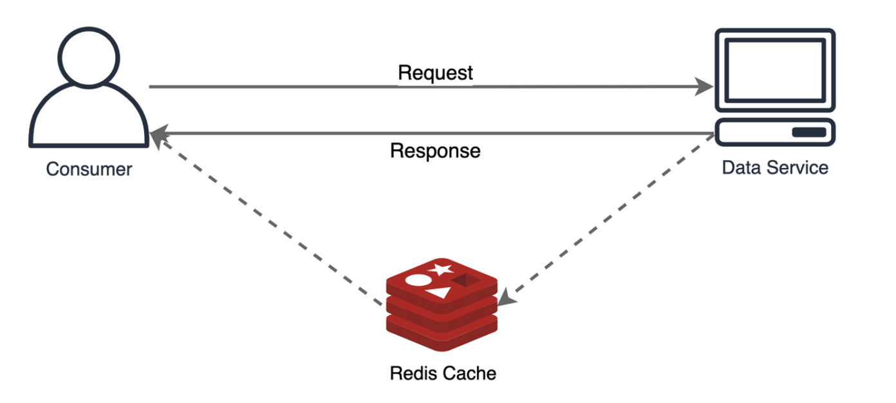

- 데이터의 원본보다 더 빠르고 효율적으로 액세스 할 수 있는 **임시 데이터 저장소**
- 자주 사용하는 데이터 값을 미리 복사해서, 캐시를 활용하여 응답속도를 줄일 수 있음
- 애플리케이션의 리소스를 줄일 수 있고, 데이터 저장소에 접근할 수 없는 상황이 발생했을 때 캐시 데이터로 대응 가능

### 캐시 도입시 성능을 효과적으로 개선할 수 있는 경우

- 원본 데이터 저장소에서 데이터를 검색하는 시간이 오래걸리는 경우
    - 통계, 복잡한 계산
    - ex> 복잡한 검색조건, 통계, 계산필요
- 캐시에서 데이터를 가져오는 것이 원본 저장소에 데이터를 가져오는것보다 빠른 경우
- 잘 변하지 않는 데이터인 경우
    - 이미지, 썸네일
- 자주 검색되는 데이터인 경우

---

### **캐시로서의 레디스**

- 사용법 간단
    - 다양한 자료구조 제공
    - key-value 형태 저장으로 데이터 저장 및 반환이 간단
- 인메모리 데이터 저장소
    - 디스크 기반의 데이터 저장소(관계형 DB) 보다 검색 및 반환이 빠른
    - 평균 읽기 및 쓰기 작업 속도가 1ms 미만
- 자체 고가용성 기능
    - 센터널 또는 클러스터 기능
        - 마스터 노드의 장애를 감지해 페일오버 발생
        - 캐시 저장소 정상적으로 유지 가능

---

### 캐싱전략(Cashing Strategues)

1) 읽기 전략 

(1) `Look-aside(Lazy Loading)`
- 캐시에서 데이터를 찾고, 캐시에서 데이터가 없는 경우에만 DB에서 읽어오는 전략
- 데이터를 읽는 작업이 많을 때 사용 하는 전략으로 가장 일반적인 배치 방법
 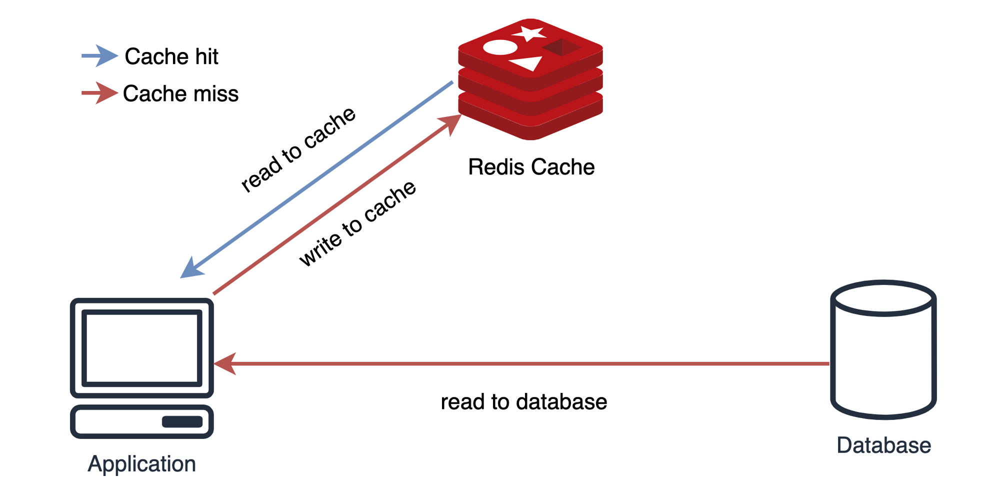

- 작동 순서
    - 찾고자 하는 데이터가 캐시에 있는지 먼저 확인
    - 캐시에 데이터가 있으면 캐시에서 데이터 조회
    - 캐시에 데이터가 없으면 원본 데이터 베이스에서 데이터 조회
    - 이를 캐시에 저장
- 장점
    - 레디스에 문제가 생겨도, 원본 데이터 베이스로 부터 데이터 조회 가능
- 단점
    - 레디스에 장애가 생기면 바로 원본 데이터 베이스의 부하로 이어짐
- Tip : 캐시워밍(cache warming)
    - 캐시를 새롭게 투입하거나, DB에만 새로운 데이터가 있는 경우 cache miss 발생하면서 DB 부하 급증
    - 미리 데이터베이스에서 캐시로 데이터를 밀어넣어주는 작업)을 통해 cache miss를 줄이는 것을 추천
     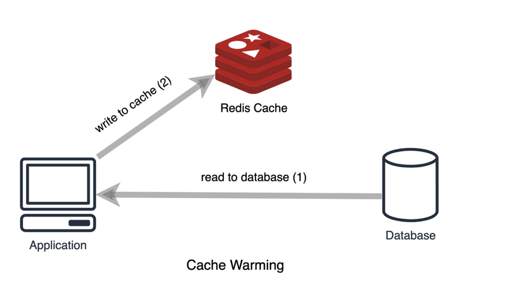
    

(2) `Read Through`
- 캐시에서만 데이터를 읽어오는 전략
  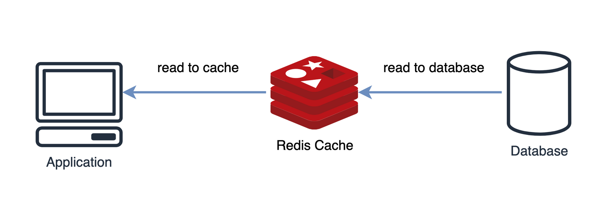
- 장점 : 캐시와 DB간의 데이터 동기화가 항상 이뤄짐 (데이터 정합성)
- 단점
    - 상대적으로 느린 속도
    - 레디스 장애 서비스 장애로 이어짐

2) 쓰기 전략

데이터 베이스에 있는 원본 데이터와 캐시에 있는 데이터가 동일하도록 유지해야함

(1) `write through` 
- 데이터 베이스에 데이터를 업데이트할 때 마다 캐시에서도 업데이트하는 방식
  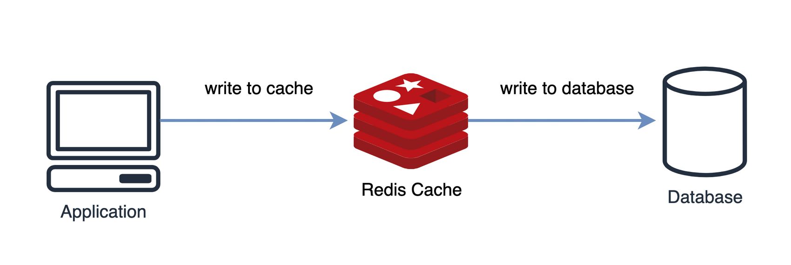
- 장점 : 항상 최신 데이터
- 단점
    - 데이터베이스와, 캐시에 모두 저장해야하므로 상대적으로 느린속도
    - 데이터가 데이터베이스와, 캐시에 모두 저장되므로 리소스 낭비 (만료시간 설정 권장)

(2) `cash invalidation (캐시 무효화)` 

- 데이베이스에 값을 업데이트 할 때마다 캐시에서는 데이터를 삭제하는 방식

(3) `write behind`

- 캐시에 먼저 데이터를 업데이트한 뒤, 건수나 특정 시간 간격 등에 따라 비동기적으로 데이터 베이스에 데이터 업데이트하는 방식
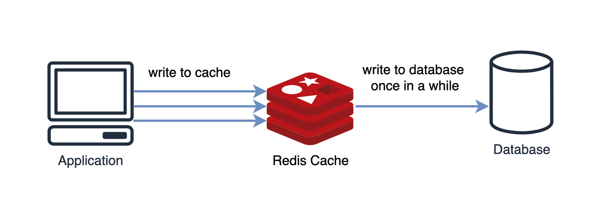

- 실시간으로 정확한 데이터가 아니여도 되는 경우
    - ex> 스트리밍 사이트의 좋아요 수
- 레디스에 장애가 생긴경우 데이터 유실 발생 가능

(4) `write around`

- DB에만 데이터 업데이트하고 읽은 데이터만 캐시에 저장하는 방식
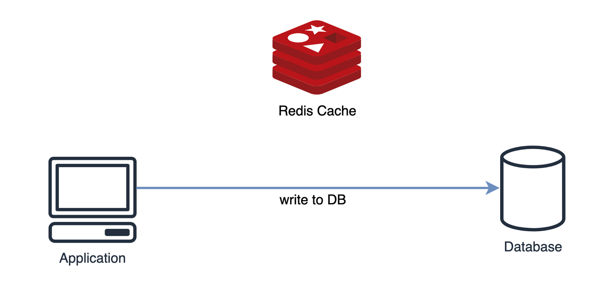
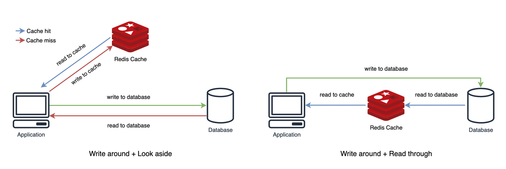

---

## 캐시에서의 데이터 흐름

---

### 만료시간

- 레디스는 특정 키에 대한 만료시간을 설정 가능
- 데이터의 수명을 관리하고 메모리 공간을 효율적으로 사용할 수 있음
- 일반적으로 초단위로 표현되고, 지정된 시간이 지나면 레디스에서 해당 키를 자동으로 삭제
    - `TTL`, `EXPIRE` → 초 단위 동작
    - `PTTL`, `PEXPIRE`→ 밀리세컨드 단위 동작
- 데이터 값이 변경되거나, 키의 이름이 변경되도 만료시간은 변경되지 않음

```bash
# a라는 key에 100 입력
SET a 100

# a키의 만료시간(초) 60 설정
EXPIRE a 60

# 남은 만료시간 조회
TTL <key>
## 키가 존재하지 않을 경우 -2
## 키에 만료시간이 지정되지 않았을 경우 -1
```

- 레디스에서 키를 삭제하는 방식
    - `passive` 방식 : 사용자가 만료시간이 끝난 키에 접근하고자 할때, 메모리에서 삭제(수동적), 사용자가 접근하지 않는다면 삭제되지 않음
    - `active` 방식 :
        - TTL 값이 있는 키들중 20개를 랜덤하게 뽑아낸 뒤, 만료된 키를 삭제
        - 랜덤하게 뽑은 키에서 25% 이상의 키가 삭제된다면, 다시 20개의 키 랜덤하게 뽑은 뒤 만료시간 확인 후 삭제, 아니라면 뽑아놓은 키 집합에서 만료시간 확인
        - 1초의 10번씩 수행

### 메모리 관리와 maxmemory-policy 설정

- 만료시간을 설정하는 것만으로는 메모리를 안정적으로 관리할 수 없음
- 메모리가 가득 차는 상황이 생기면 레디스는 내부 정책을 통해 어떤 키를 삭제할지 결정
    - `maxmemory` : 데이터 최대 저장 용량 설정
    - `maxmemory-policy` : 데이터 용량이 초과될 때  처리하는 방식  설정
- Redis에서 제공하는 Eviction 정책
    
    1) `noeviction` (기본값)
    
    - maxmemory에 도달한 상태에서 클라이언트가 새로운 데이터를 저장하려고 할때, 에러 반환
    - 캐시 내부적 판단으로 데이터를 삭제하는것이 아니고 삭제를 직접 해야함
    
    2) `LRU(Least Recently Used) eviction`
    
    - 사용한지 가장 오래된 데이터부터 삭제
        
        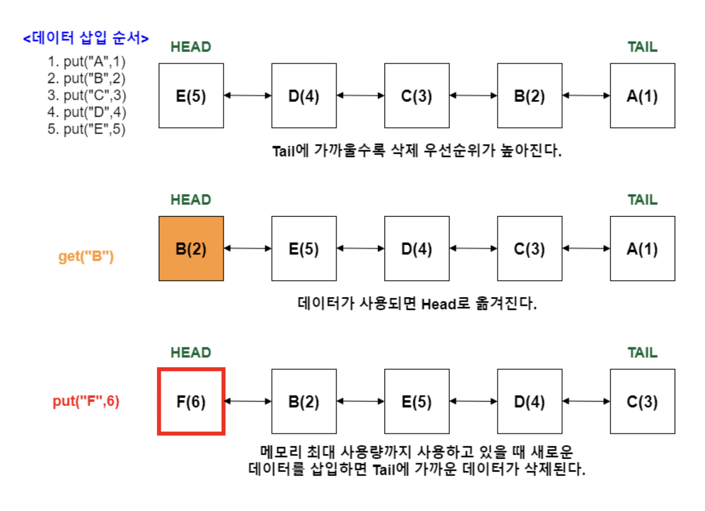
        
        (1) `allkeys-lru` : 모든 키를 대상으로 LRU 알고리즘 적용하여 키 삭제
        
        (2) `volatile-lru`
        
        - 만료시간이 설정된 키를 대상만 LRU 알고리즘 적용하여 키 삭제
        - 만료시간이 설정되지 않은 키는 삭제되지 않음
    
    3) `LFU(Least Frequently Used) eviction`
    
    - 사용 빈도수가 가장 적은 데이터부터 삭제
        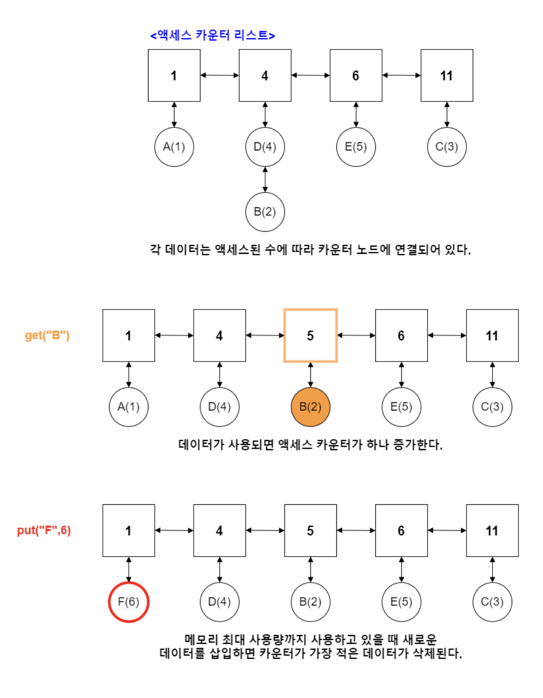
        (1) `allkeys-lru`
        (2) `volatile-lru`

    4)  `RANDOM eviction`
    
    - 무작위로 키를 골라서 삭제
    - `allkeys-lru`, `volatile-lru` 설정 가능
    
    5) `volatile-ttl`
    
    - TTL 시간이 짧은 데이터 부터 삭제
    - 만료 시간이 설정된 키를 대상으로 TTL이 짧은 데이터 부터 삭제
    
    
    
    💡 LRU, LFU, TTL 알고리즘은 근사 알고리즘으로 구현
    


### 캐시 스탬피드 현상 (cache stamplede)

- 캐시 만료로 인해 많은 데이터 조회 요청이 DB로 갑자기 몰리는 현상을 말합니다.
- 중복 읽기, 중복 쓰기 발생
- 적절한 만료 시간 설정하여 캐시 스탬피드를 줄여야 함
    
    1) 선계산 : 키 만료전에 값 갱신
    
    - PER 알고리즘
        - 키가 만료되기 전에 언제 DB에서 값을 읽어오면 되는지 최적으로 계산
        
        <aside>
        💡 currentTime - (timeToCompute * beta * log(rand())) > expiry
        
        currentTime : 현재 남은 만료 시간
        timeToCompute: 캐시된 값을 다시 계산하는 데 걸리는 시간
        beta : 1.0 보다 큰 값으로 설정 가능
        rand() : 0과 1 사이의 랜덤 값 반환
        expiry : 키를 재설정할 때 새로 넣어줄 만료 시간
        마
        
        </aside>
        

---

## 세션 스토어로서의 레디스

---

### 세션이란?

- 서비스를 사용하는 클라이언트의 상태 정보를 의미
    - 로그인 돼있는 클라이언트 정보 : 누구인지, 어떤 활동을 하고 있는지 등
    - 장바구니, 최근 확인한 아이템
    - 사용자 행동 분석 가능

### 세션 스토어가 필요한 이유

- 서버가 1대일때는 서버에서 자체적으로 해결 가능하나, 여러개의 서버가 있는 경우 데이터 정합성을 위해 외부 세션 스토어 운영이 필요
    
    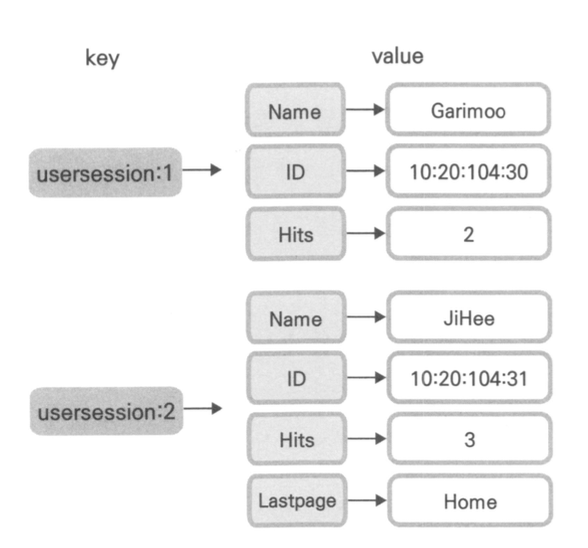

### 캐시와 세션의 차이
- 캐시는 데이터베이스의 완벽한 서브셋으로 동작
- 캐시에 있는 데이터는 DB에 모두 저장
- 캐시 내부에 데이터가 유실되더라도 DB에서 찾을 수 있음
  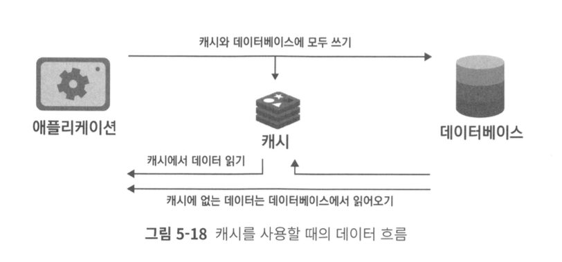
- 세션이 활성화돼있는 동안 유저의 데이터를 세션 스토어에만 저장 (DB 저장 X)
- 데이터에 따라 아예 삭제되거나, DB에 저장
- 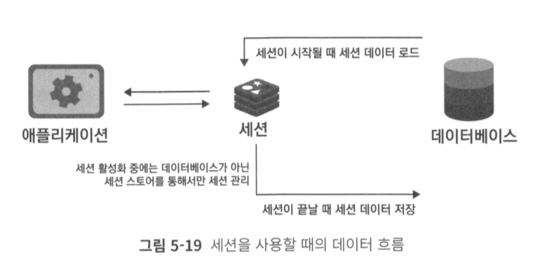

---

이미지 출처

[https://yoongrammer.tistory.com/101](https://yoongrammer.tistory.com/101)
[https://chagokx2.tistory.com/102](https://chagokx2.tistory.com/102)