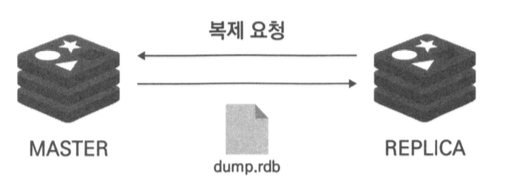
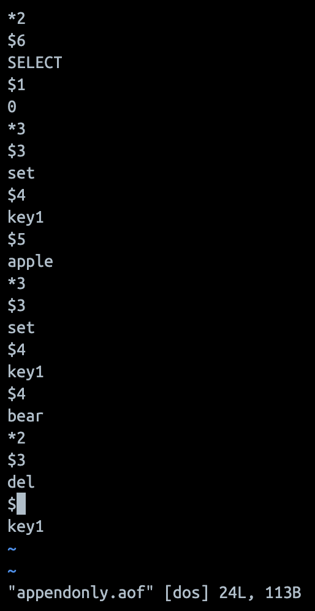
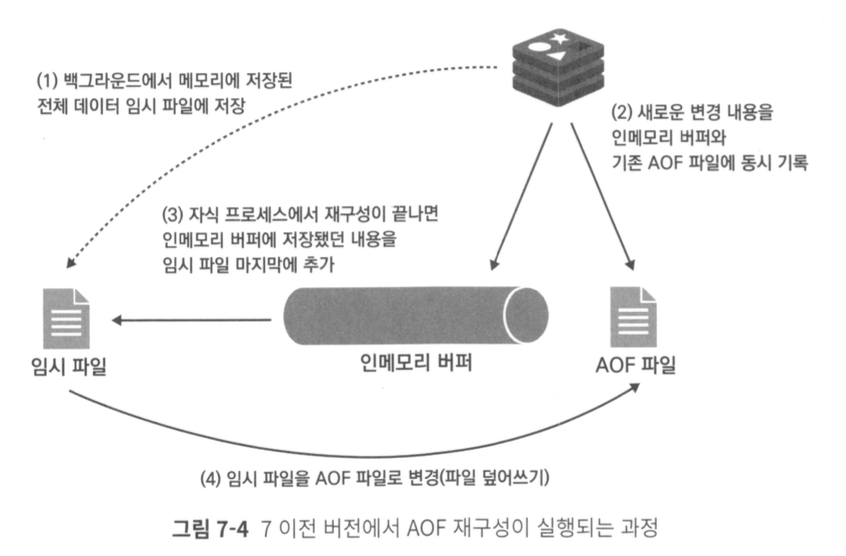
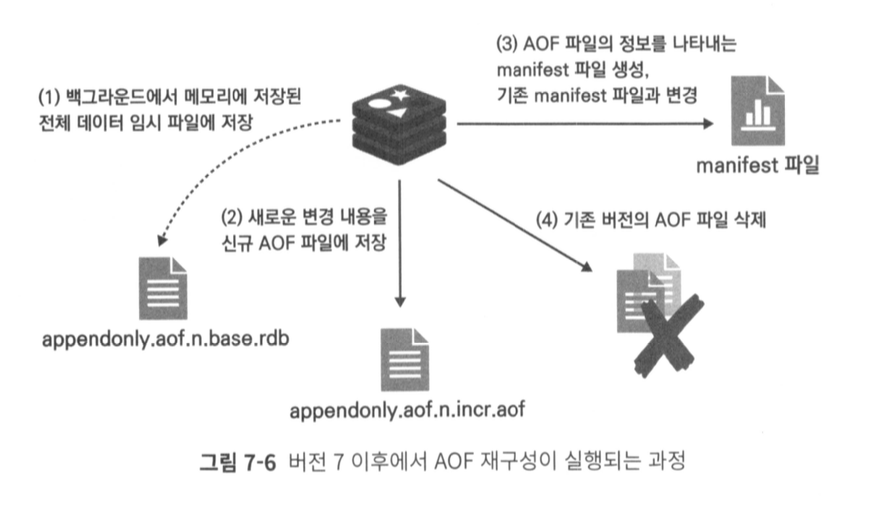
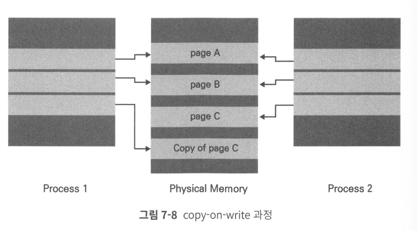
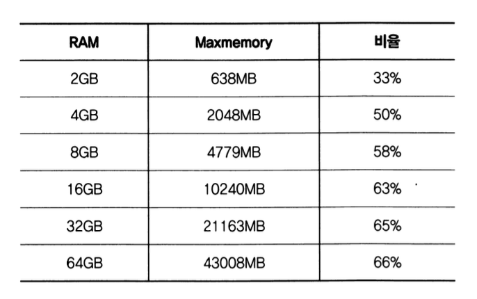

# 07. 레디스 데이터 백업 방법

## 레디스에서 데이터를 영구 저장하기

---

- 메모리 방식의 DB인 레디스는 인스턴스 재시작시 데이터 손실될 가능성 존재
- 레디스 복제 구조만으로는 데이터 안전하게 유지할 수 없음
    - 예시) 삭제 커맨드 실행시, 레디스 복제본에서도 삭제
- 주기적으로 디스크에 백업하는 방식을 사용해야함
- `RDB`방식과 `AOF` 방식이 존재 : 두가지를 동시에 사용 가능
    1. `RDB(Redis DataBase)` 
        - 일종 시점에 메모리에 저장된 `데이터 전체를 저장(snapshot방식)`
        - 바이너리 형태로 저장
        - 복원이 빠르지만, 특정 시점으로의 복구 불가능(저장된  시점으로만 복구 가능)
    2. `AOF(Append Only File)`  
        - 레디스 인스턴스가 처리한 `모든 쓰기작업을 차례대로 기록`. 복원 시에는 파일을 다시 읽어가며 데이터 세트 재구성
        - 레디스 프로토콜(RESP)형태로 저장
        - RDB파일보다 크기가 크고 주기적으로 압축해서 재작성 해야하지만, 원하는 시점으로 복구가 가능
- `서버가 재시작될 때만 데이터 복원 가능` (레디스 실행 도중에는 복구 작업 불가)
- 레디스 재시작시 저장된 RDB, AOF 파일이 있는 지 확인 후 해당파일 로드
- RDB, AOF 파일이 모두 존재할 때는 AOF 파일을 로드

---

## RDB 방식의 데이터 백업

---

1. 특정 조건에 자동으로 RDB 파일 생성
    - redis.conf에 지정
    - 사용자가 지정한 시간 단위로 파일 저장
    - 마지막 저장 시점부터 장애가 발생하기 직전까지의 데이터는 손실 될 수 있음
2. 수동으로 RDB 파일 생성
3. 복제 기능 사용시 자동으로 RDB 파일 생성

### 특정 조건에 자동으로 RDB 파일 생성

```bash
save <기간(초)> <기간 내 변경된 키의 개수)
dbfilename <RDB 파일 이름>
dir <RDB 파일이 저장될 경로>

# 현재 적용된 save 옵션 확인
127.0.0.1:6379> CONFIG GET save
1) "save"
2) "900 1 300 10 60 10000"

# default 저장 경로
/var/lib/redis  dump.rdb
```

### 수동으로 RDB 파일 생성

- 파일 생성 : `SAVE`, `BGSAVE`
- `SAVE`:  동기 방식으로 파링 저장. 파일 생성이 완료될 때까지 다른 모든 클라이언트의 명령 차단
- `BGSAVE` : 자식 프로세스가 백그라운드에서 RDB 파일을 생성한 뒤 종료. 이미 백그라운드로 데이터가 저장되고 있는경우 에러 반환
    - `SCHEDULE` : 기존에 진행 중이던 백업 완료 후 실행 하도록 하는 옵션값
- 파일 저장 확인 : `LASTSAVE`
    - RDB 파일이 저장된 시점을 유닉스 타임스탬프로 반환

### 복제를 사용할 경우 자동으로 RDB 파일 생성



- 복제본에서 REPLICAOF로 복제 요청시 마스터 노드에서 RDB 파일을 생성해 복제본에 전달
- 이미 복제 연결이 돼있는 상태에서 일정시간 이상 복제가 끊어졌다가 복구된 경우에도 마스터 노드에서 RDB 파일 생성해 복제본에 전달

### AOF 방식의 데이터 백업

- 수행된 모든 쓰기 작업의 로그를 차례로 기록(레디스 프로토콜 형식)
- AOF 파일을 열어 특정 커맨드 이력 삭제 가능

```bash
# redis.conf
appendonly yes
appendfilename "appendonly.aof"
appenddirname "appendonlydir"

service redis-server restart

#default 저장
/var/lib appendonly.aof
```



### AOF 파일을 재구성 하는 방법

- AOF 파일은 쓰기작업을 차례로 저장하기 때문에, 점점 파일의 크기가 커짐
- 주기적으로 압축시키는 재구성 작업 필요
- 압축시, 디스크에 있는 AOF 파일이 아닌, 메모리에 있는 데이터를 읽어와서 새로운 파일로 저장
- redis.conf파일에 `aof-use-rdb-preamble` no 설정 필요
    - yes 설정시 RDB로 저장 : *.base.rdb
    - no 설정시 AOF로 변환 : *.base.aof
1. redis 7 이전버전



(1) 레디스는 fork를 이용해 자식 프로세스를 생성. 생성된 자시 프로세스는 레디스 메모리의 데이터를 읽어와 신규로 생성한 임시 파일에 저장

(2) 백그라운드로 (1)의 과정이 진행되는 동안 레디스 메모리의 데이터가 변경된 내역은 `기존의 AOF 파일과 인메모리 버퍼에 동시에 저장`

(3) (1)의 AOF 재구성 과정이 끝나면 인메모리 버퍼에 저장된 내용을 (1)의 임시 파일 마지막에 추가한다.

(4) 생성된 임시 파일로 기존 AOF 파일을 덮어 씌운다.

- AOF 파일 내에 바이너리 형태와 RESP의 텍스트 형태의 데이터가 함께 저장. 수동으로 AOF파일을 처리할때 관리가 복잡해질 수 있음
1. redis 7 이후 버전
- 이전 버전과 차이점 : RDB파일과 AOF파일을 나눠서 데이터를 관리



(1) 레디스는 fork를 이용해 자식 프로세스를 생성. 생성된 자시 프로세스는 레디스 메모리의 데이터를 읽어와 신규로 생성한 임시 파일에 저장

(2)  백그라운드로 (1)의 과정이 진행되는 동안 레디스 메모리의 데이터가 변경된 내역은 `신규 AOF 파일에 저장`

(3) (1)의 AOF 재구성 과정이 끝나면 임시 매니페이스 파일을 생성한 뒤, 변경된 버전으로 매니페스트 파일 내용을 업데이트

(4) 생성된 임시 매니페스트파일로 기존 매니페스트 파일을 덮어 씌운 뒤, 이전 버전의 AOF, RDB 파일을 삭제한다.

### 자동 AOF 재구성

```bash
auto-aof-rewrite-percentage 100
auto-aof-rewrite-min-size 64mb
```

- `auto-aof-rewrite-percentage`  마지막으로 재구성된 AOF 파일의 크기와 비교해, 현재의 AOF 파일이 지정된 퍼센트 만큼 커졌을 때 재구성 시도
- 마지막으로 저장된 AOF 파일의 크기 확인 방법

```bash
> INFO Persistence

# 현재 파일 크기
aof_current_size:113

# 마지막 파일 크기
aof_base_size:0

# 인스턴스 처음 부팅시 aof_base_size는 0이므로 auto_aof_rewrite_min_size를 기준으로 데이터 구성

```

### 수동 AOF 재구성

- `BGREWRITEAOF`

### AOF 타임스탬프

```bash
aof-timestamp-enabled yes
```

### AOF 파일의 안정성

- `APPENDSYNC` no :
    - AOF  저장시 `WRITE 시스템 콜` 호출. 데이터가 커널 영역에 데이터가 잘 저장되는지만 확인
    - 쓰기성능 가장 빠름
    - 최대 30초 동안 레디스에 입력했던 데이터 유실 가능
- `APPENDFSYNC` always : AOF 저장시 `WRITE와 FSYNC 시스템 콜` 함께 호출. 데이터가 파일에 정확하게 저장되는지 확인.
    - 쓰기성능 가장 느림
- `APPENDSYNC` everysec (권장)
    - AOF 저장시 WRITE 시스템 콜을 호출하며, 1초에 한번씩 FSYNC 시스템 콜 호출
    - 성능은 no 옵션과 동일
    - 최대 1초동안 레디스에 입력했던 데이터 유실 가능

---

## 백업을 사용할 때 주의할 점

- RDB와 AOF 파일 사용시 인스턴스의 maxmemory값은 실제 메모리보다 여유를 갖고 설정
- BGSAVE : 자식프로세스가 레딧의 메모리를 그대로 파일에 저장. 기존 부모 프로세스와는 다른 메모리 데이터를 이용해 다른 클라이언트와의 연결 처리 필요
- COW(Copy-On-Write) 방식을 이용해 백업을 진행하면서도 클라이언트의 요청사항을 수행



- 참고할만한 설정값

