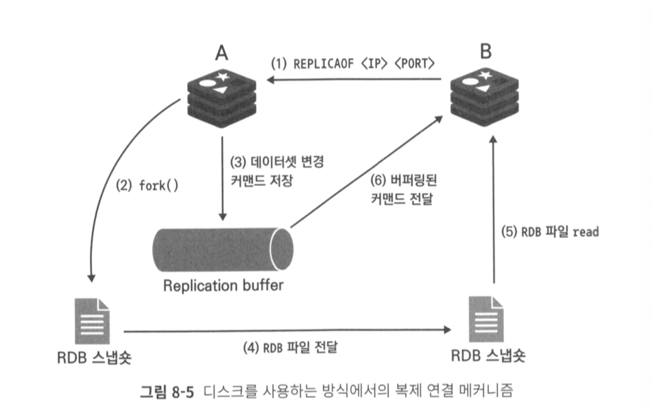
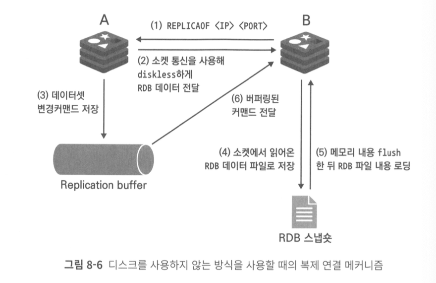
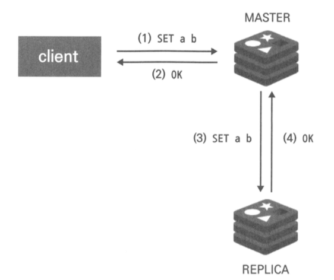
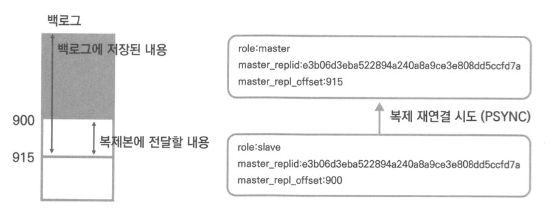

# 08. 복제

- 가용성이란?  일정 시간동안 서비스를 정상적으로 사용할 수 있는 시간의 비율
- 레디스에서 고가용성 확보하기
    - 복제
        - 마스터 노드의 데이터를 복제본 노드로 실시간 복사
        - 마스터 노드 장애시 복제본 노드에서 데이터 확인
    - 자동 페일오버
        - 장애감지 후 클라이언트 연결을 자동으로 복제본 노드로 리디렉션 하는 기능
        - 수동으로 엔드포인트 변경이 필요없음
    
    ## 레디스에서의 복제구조
    
    ---
    
    - 마스터 데이터베이스에 장애가 발생할 때 대신 사용할 여유분의 복제본 필요
    - 트래픽 감소역할 : 부하 분산을 통해 일부 트래픽을 복제본에서 해결
    - 백업을 복제본에서 수행
    - 복제본은 읽기 커맨드만 수행 가능. 모든 데이터 입력은 마스터 노드에서 수행
    
    ### 복제구조 구성하기
    
    ```bash
    REPLICAOF <master-ip> <master-port>
    CONFIG SET masterauth mypassword
    ```
    
    ```bash
    # 복제본에서 쓰기 커맨드 실행
    set key yes yes
    (error) READONLY You can't write against a read only replica.
    
    # docker-compose.yml
    opt/bitnami/redis/etc config 파일 위치
    ```
    
    ---
    
    ## 복제 메커니즘
    
    ---
    
    - 버전 7 이전에서는 `repl-diskless-sync no`
    
    
    
    (1) REPLICAOF 커맨드로 복제 연결 시도
    
    (2) 마스터 노드에서는 fork로 자식 프로세스를 새로 만든 뒤 RDB snapshot을 생성
    
    (3) (2)번 과정 동안 마스터 노드에서 수행된 모든 데이터셋 변경 작업은 레디스의 프로토콜 형태로 마스터의 복제버퍼에 저장
    
    (4) RDB 파일이 생성 완료되면 파일은 복제본 노드로 복사
    
    (5) 복제본에 저장됐던 모든 내용을 모두 삭제한 뒤 RDB 파일을 이용해 데이터를 로딩
    
    (6) 복제 과정 동안 버퍼링됐던 복제 버퍼의 데이터를 복제본으로 전달해 수행
    
- 버전 7 이상에서는 `repl-diskless-sync yes`
    - 디스크를 사용하지 않는 방식
    
    
    
    (1) REPLICAOF 커맨드로 복제 연결 시도
    
    (2) 마스터 노드는 소켓 통신을 이용해 복제본 노드에 바로연결. RDB 파일은 생성됨과 동시에 점진적으로 복제본의 소켓에 전송
    
    (3) (2)의 과정동안 마스터 노드에서 수행된 모든 데이터셋 변경 작업은 레디스 프로토콜 형태로 마스터의 복제 버퍼에 저장
    
    (4) 소켓에서 읽어온 RDB 파일을 복제본 데스크에 저장
    
    (5) 복제본에 저장됐던 모든 내용을 삭제한 뒤 RDB 파일 내용을 메모리에 로딩
    
    (6) 복제 버퍼의 데이터를 복제본으로 전달해 수행
    
    - 디스크를 사용하지 않은 방식의 경우 이미 하나의 복제연결이 시작된 경우 복제과정이 끝나기 전까지 다른 복제본과의 연결 수행할 수 없음
    - `repl-diskless-sync delay 5` : 새로운 복제요청시 5초를 기다린 후 복제 연결. 재동기화 요청시 마스터에 여러 개의 복제본에서 복제연결이 들어오는것이 일반적이기 때문에 옵션사용 활성화 권장
    

### 비동기 방식으로 동작하는 복제 연결

- 데이터 전달은 비동기 방식으로 동작



- 클라이언트는 복제본까지 데이터가 정확하게 전달됬는지 확인하지 않음
- 짧은 지연 시간과 높은 성능

### 복제 ID

- 모든 레디스 인스턴스는 복제기능을 사용하지 않더라도 복제 ID를 가지고 있음
- 복제 ID는 오프셋과 쌍으로 존재
- 데이터 수정 커맨드 수행할 때마다 오프셋 증가
- `INFO Replication`

```bash
127.0.0.1:6379> INFO Replication

# Replication
role:master
connected_slaves:2
slave0:ip=172.25.0.4,port=6379,state=online,offset=309,lag=0
slave1:ip=172.25.0.3,port=6379,state=online,offset=309,lag=0
master_failover_state:no-failover
master_replid:f00140fbe327b1b173b1265043bebaeaf576d393
master_replid2:0000000000000000000000000000000000000000
master_repl_offset:309
second_repl_offset:-1
repl_backlog_active:1
repl_backlog_size:1048576
repl_backlog_first_byte_offset:1
repl_backlog_histlen:309
```

### 부분 재동기화

- 마스터는 커넥션 유실을 대비해 백로그 버퍼라는 메모리 공간에 복제본에 전달할 커맨드 데이터를 저장
- 연결이 끊겼다가 재연결된 복제본은 PSYNC 커맨드를 호출해 자신의 replication id와 offset을 마스터에 전달



- 마스터 백로그 버퍼에 원하는 데이터가 남아있지않거나, replication ID가 현재의 마스터와 일치하지 않는다면 전체 재동기화 시도
- 복제본은 언제든지 마스터로 승격 가능 → 복제 연결이 없더라도 백로그 버퍼를 해체하지 않음

### Secondary 복제 ID

- 레디스가 2개의 복제 ID를 갖는 이유는 마스터로 승격되는 복제본 때문이며, 같은 복제 그룹 내에서 페일오버 이후 승격된 새로운 마스터에 연결된 복제본은 전체 재동기화를 수행할 필요가 없을 수 있음

### 읽기 전용 모드로 동작하는 복제본 노드

- 복제본에서는 읽기 전용 모드로 동작
- replica-read-only설정을 해제해서 복제본에서 쓰기작업을 하는 경우 마스터 또는 다른 복제본으로 데이터가 전달되지않음