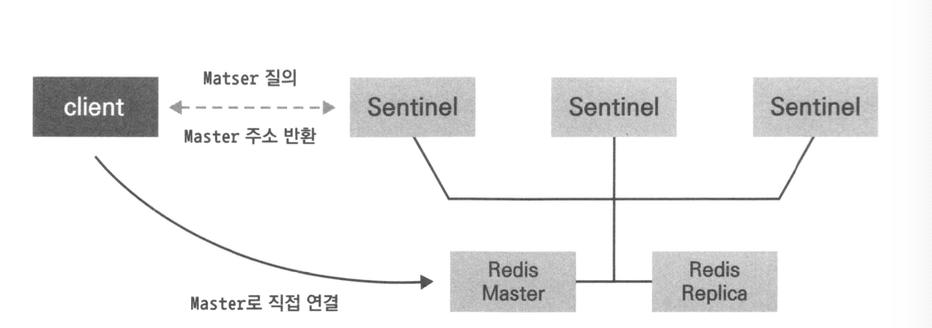
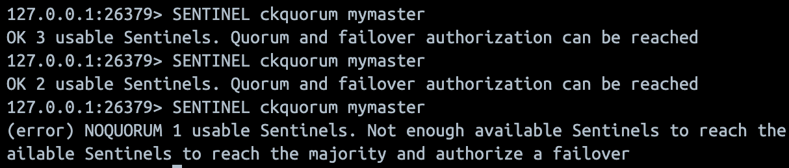
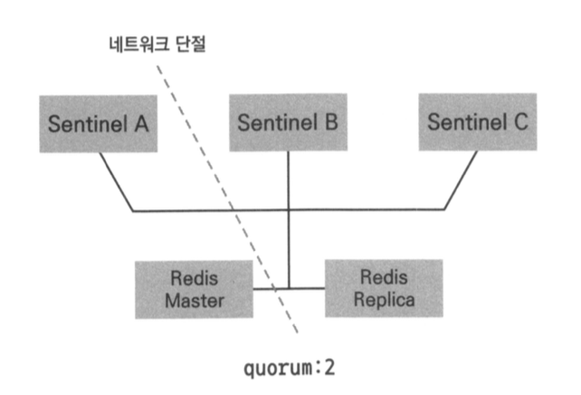
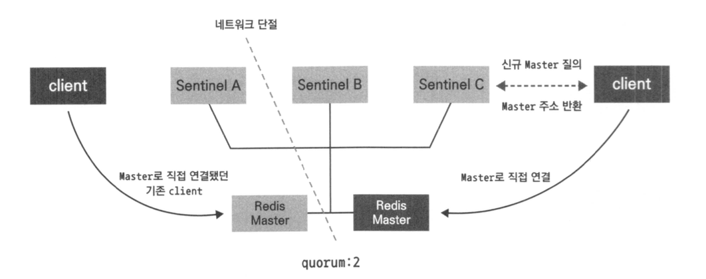

# 09. 센티널

## 고가용성 기능의 필요성

- 고가용성 기능이 없다면?
    - 레디스 인스턴스 재시작시 메모리에있는 데이터 유실
    - 마스터 노드 장애시 대응이 어려움

## 센티널이란?

- 레디스의 자체 고가용성 기능
- 인스턴스 장애시 자동 페일오버 기능으로 레디스 다운타임을 최소화

### 센티널 기능

- 모니터링 : 마스터, 복제본 인스턴스의 상태를 실시간 확인
- 자동 페일오버 : 마스터의 비정상 상태를 감지해 정상상태의 복제본 중 하나를 마스터로 승격
- 인스턴스 구성 정보 안내 : 클라이언트에게 마스터정보 제공



```bash
version: '2'

networks:
  app-tier:
    driver: bridge

services:
  redis:
    image: 'bitnami/redis:latest'
    environment:
      - REDIS_REPLICATION_MODE=master
      - ALLOW_EMPTY_PASSWORD=yes
    networks:
      - app-tier
    ports:
      - 6379:6379
  redis-slave-1:
    image: 'bitnami/redis:latest'
    environment:
      - REDIS_REPLICATION_MODE=slave
      - REDIS_MASTER_HOST=redis
      - REDIS_MASTER_PORT=6379
      - ALLOW_EMPTY_PASSWORD=yes
    ports:
      - 6479:6379
    depends_on:
      - redis
    networks:
      - app-tier
  redis-slave-2:
    image: 'bitnami/redis:latest'
    environment:
      - REDIS_REPLICATION_MODE=slave
      - REDIS_MASTER_HOST=redis
      - REDIS_MASTER_PORT=6379
      - ALLOW_EMPTY_PASSWORD=yes
    ports:
      - 6579:6379
    depends_on:
      - redis
    networks:
      - app-tier

  redis-sentinel:
    image: 'bitnami/redis-sentinel:latest'
    environment:
      - REDIS_SENTINEL_DOWN_AFTER_MILLISECONDS=3000
      - REDIS_MASTER_HOST=redis
      - REDIS_MASTER_PORT_NUMBER=6379
      - REDIS_MASTER_SET=mymaster
      - REDIS_SENTINEL_QUORUM=2
    depends_on:
      - redis
      - redis-slave-1
      - redis-slave-2
    ports:
      - '26379-26381:26379'
    networks:
      - app-tier
```

```bash
docker-compose up --scale redis-sentinel=3 -d

# 마스터 IP, 포트, 연결된 복제본의 개수 확인 
**SENTINEL masters
# 마스터에 연결된 복제본 정보 확인
SENTINEL replica mymaster
# 마스터에 연결된 복제본 정보 확인
SENTINEL sentinels mymaster
#쿼럼 테스트
SENTINEL ckquorum mymaster**
```



### 페일오버 테스트

- 마스터 프로세스에 이슈가 생겼을 때, 정상적으로 페일오버가 동작하는지 확인
1. 커맨드를 이용한 페일오버 발생(수동 페일오버)

```bash
SENTINEL FAILOVER <master name>
```

1. 마스터 동작을 중지시켜 페일오버 발생(자동페일오버)

```bash
redis-cli -h redis -p 6379 shutdown
```

- `sentinel.conf`에 지정한 `down-after-milliseconds` 시간동안 마스터에서 응답이 오지 않으면 페일오버 트리거 (default = 30,000ms)

---

## 센티널 운영하기

### 패스워드 인증

- `redis.conf`
    - `requirepass` : 서버에 접속하기 위한 패스워드 값
    - `masterauth` : 마스터의 패스워드값
    - 복제 구조 사용시 requirepass와 masterauth값은 동일하게 설정 필요 (복제 노드가 마스터 노드가 될 수 있음)
- `sentinel.conf`

```bash
sentinel auth-pass <master-name> <password>

#현재 구동중인 master name 확인하기
**redis-cli -p <sentinel-port>
127.0.0.1:26379> SENTINEL masters
1)  1) "name"
    2) "mymaster"**
```

### 복제본 우선순위

- 센티널이 페일오버 진행시 각 복제본 노드의 `replica-priority` 라는 우선순위 노드를 확인
    - 해당 값이 가장 작은 노드를 마스터로 선출
    - 모든 레디스 인스턴스는 replica-priority 파라미터를 가지고 있음
- replica-priority 파라미터 기본값 100, 이 값이 0인 복제본은 마스터로 선출되지 않음

### 운영 중 센티널 구성 정보 변경

- 실행 도중 모니터링할 마스터를 추가, 제거, 변경할 수 있음
- 모든 센티널에 설정을 적용해야함
    - 하나의 센티널에 설정을 적용했다고 다른 센티널에 전파되지않음
    - `SENTINEL MONITOR` : 새로운 마스터를 모니터링하도록 설정
        
        ```bash
        SENTINEL MONITOR <master name> <ip> <port> <quorum>
        ```
        
    - SENTINEL REMOVE : 마스터 모니터링 해제
        
        ```bash
        SENTINEL REMOVE <master name>
        ```
        
    - SENTINEL SET:  특정 마스터에 대해 지정한 파라미터 변경
        
        ```bash
        # 마스터 다운 판단 시간 재설정
        SENTINEL SET <mastername> down-after-milliseconds <초(ms)>
        
        # 쿼럼 값 재설정
        SENTINEL SET <mastername> quorum 1
        
        # 마스터에 종속되지 않는 센티널 설정 변경
        SENTINEL CONFIG GET <configuration name>
        SENTINEL CONFIG SET <configuration name> <value>
        ```
        

### 센티널 초기화

- 비정상적인 복제본 노드도 모니터링
- 마스터 노드, 복제본 노드에 장애가 발생하더라도 계속 모니터링 시도
- 주기적으로 계속 PING을 통해 상태 확인
- 레디스 인스턴스에 대한 모니터링을 중단하기 위해서는 `SENTINEL RESET` 커맨드 사용 필요
    - 센티널 인스턴스의 상태 정보를 초기화하고, 센티널이 모니터링하고 있는 마스터, 복제본, 다른 센티널 인스턴스의 정보를 새로 고침
    - 마스터 이름을 지정하지 않으면 센티널이 모니터링 하는 전체 마스터 정보 초기화 가능
    
    ```bash
    
    # 특정 마스터 정보 초기화
    SENTINEL RESET <master name>
    
    # 모니터링 하고 있는 전체 마스터 정보 초기화
    SENTINEL RESET 
    ```
    

### 센티널 노드의 추가/제거

- 현재 구성에서 새로운 센티널 노드를 추가하는 방법
    - 마스터를 모니터링 하도록 설정한 센티널 인스턴스를 실행시키면 자동 검색 메커니즘에 의해 기존에 실행중이던 센티널의 known-list에 추가
    - 한번에 여러개를 추가해야하는 경우 10초 이상의 간격을 두고 인스턴스 실행 필요
    
    ```bash
    # 해당 마스터를 모니터링하고 있는 센티널 수 확인
    SENTINEK MASTER <master name>
    > num-other-sentinels 값 확인
    ```
    
- 장애가 발생한 센티널 노드를 제거 하고 싶은 경우
    - `SENTINEL RESET` 커맨드 실행

### 센티널의 자동 페일오버 과정

1. 마스터의 장애 상황 감지
    - 마스터 노드에 PING을 통해 마스터 노드 유효성 확인
        - +PONG , -LOADING, -MASTERDOWN
        - down-after-millseconds 안에 유효한 응답을 받야함
2. sdown, odown 실패 상태로 전환
    - 마스터 인스턴스에 응답을 늦게 받는 경우 센터널을 해당 마스터의 상태를 우선 `sdown`으로 플래깅 (`subjectly down` : 주관적인 다운 상태)
    - 다른 센트널 노드들에게 `is-master-down-by-addr <master-ip> <master-port><current-epoch> <*>`  커맨드로 장애 사실 전파
    - 커맨드를 받은 센티널들은 해당 서버의 장애를 인지했는지 여부를 응답
    - 자기자신을 포함해 쿼럼 값 이상의 센티널 노드에서 마스터의 장애 인지시 마스터의 상태를 odown으로 변경(`objectly down` : 객관적 다운)
    - odown은 마스터 노드일때만 변경. 복제본 노드의 경우 sdown으로 태깅하는 것에서 마무리
    - 페일오버 진행시 sdown 상태의 복제본은 마스터로 승격되지 않음
3. 에포크 증가
    - 마스터 노드가 odown 생태가 되는 페일 오버 과정 시작
    - 센티널은 에포크라는 개념을 이용해 페일오버 버전 관리
        - 페일오버 시작전 에포크값 하나 증가
        - 처음 페일오버가 일어날 때의 에포크 값은 1
4. 센티널 리더 선출
    - 에포크를 증가시킨 센티널은 다른 센티널 노드에게 센티널 리더를 선출을 위한 투표요청 메시지 전송 (에포크값과 함께)
    - 메시지를 받은 다른 센티널 노드가 메시지에 있는 에포크값과 현재 가지고 있는 에포크 값을 비교
        - 자신의 에포크가 작은 경우 에포크를 증가 시킨 후 센티널 리더에게 투표하겠다는 응답 전송
        - 자신의 에포크와 메시지에 담긴 에포크가 동일한 경우 이미 리더로 선출한 센티널의 id 응답
    - 하나의 에포크에서 리더 선출은 인스턴스당 한번만 이뤄짐
    
    <aside>
    💡 과반수와 쿼럼
    - sdown → odown : 쿼럼 값 이상의 센티널이 동의하면 상태 변경 
    - 페일오버 : 과반수 이상의 센티널이 페일오버를 동의해야 발생
    
    </aside>
    

5. 복제본 선정 후 마스터로 승격

- 과반수 이상의 센티널이 페일오버에 동의했다면, 리더 센티널은 마스터가 될 수 있는 복제본 선정
- 다음과 같은 순으로 마스터 선출
    - redis.conf 파일에 명시된 replica-priority가 낮은 복제본 (0은 안됌)
    - 마스터로부터 더 많은 데이터를 수신한 복제본(master_repl_오프셋)
    - runId가 사전 순으로 작은 복제본
1. 복제 연결 변경
2. 장애 조치 완료

### 스플릿 브레인 현상



- 네트워크 단절로 인해 센티널 노드간의 연결이 정상적으로 이뤄지지 않아서, 마스터가 2개이상 생기는 현상 (쿼럼 수만 채우면 마스터 승격)



- 네트워크 문제 해결시 다른 센트널에의해 기존 마스터는 복제본으로 연결
- 네트워크 단절동안 기존 마스터에서 처리된 데이터 유실