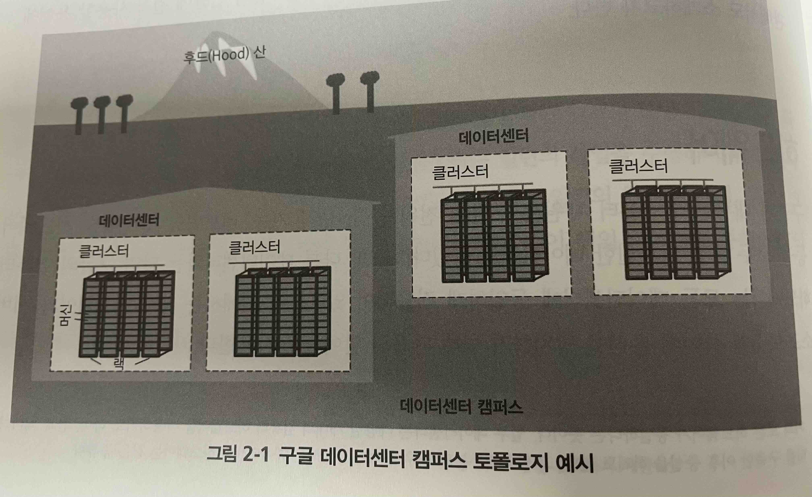
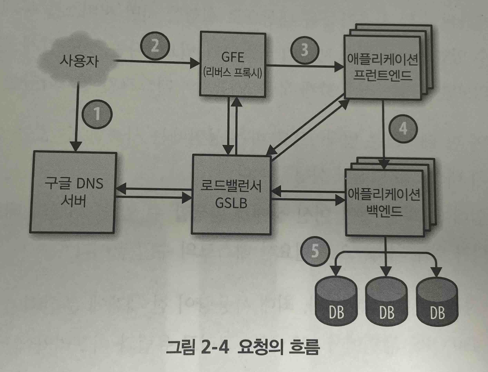

# SRE 관점에서 바라본 구글의 프로덕션 환경

* 구글의 특색 있는 데이터센터가 가지고 있는 도전과제와 기회 설명
* 이 책 전반에 걸쳐 사용할 용어 설명

## 하드웨어

#### 머신(machine)

하드웨어(혹은 가상머신(Virtual Machine, VM))를 의미

#### 서버(server)

서비스를 구현하는 소프트웨어를 의미

* 머신은 어떤 서버든지 구동할 수 있고, 머신이 구동할 서버 프로그램을 특정하진 않음
* 클러스터 운영 시스템인 보그(Borg)가 자원의 할당을 책임짐

### 구글 데이터센터의 토폴로지(topology)

* 수십 대의 머신이 랙(rack)에 장착되어 있음
* 랙은 일렬로 늘어서 있음
* 하나 또는 여러 랙이 클러스터를 구성함
* 통상 데이터센터 건물 내에는 여러 개의 클러스터가 갖춰져 있음
* 근거리의 여러 데이터 센터 건물이 모여 캠퍼스를 이룸
* 데이터센터 내의 머신들이 서로 통신 가능하도록 수만 개의 포트로 이루어진, 엄청나게 빠른 가상 스위치(virtual switch)를 만듬
* 수백 대의 스위치를 연결하여 주피터(Jupiter)라는 클로스 네트워크 패브릭(Clos network fabric)을 구성함
  * 주피터는 서버 통신을 위해 1.3Pbs의 양방향 대역폭을 지원함
  * https://zdnet.co.kr/view/?no=20150619104854
* 데이터센터들은 B4라는 전 세계를 연결하는 백본을 통해 연결됨
  * B4는 소프트웨어에 기반을 둔 네트워크 아키텍처임

**스위치(switch)란?**  
> 스위치는 네트워크 장치들을 연결하고, 데이터를 목적지로 효율적으로 전달하는 장비입니다.  
> MAC 주소를 기반으로 통신하며, 충돌을 줄이고 네트워크 성능을 최적화합니다.  
> 관리형/비관리형, PoE 스위치 등 다양한 유형으로 소규모부터 대규모 네트워크에 사용됩니다.

## 하드웨어를 '조율하는' 시스템 소프트웨어

### 머신 관리하기

* 보그(Borg)라는 소프트웨어를 사용함
* 보그는 사용자의 잡(job)를 실행하는 역할을 담당함
* 사용자의 잡은 서버를 계속해서 구동하는 작업일 수도 있고 맵리듀스(MapReduce) 같은 일괄(batch) 작업을 구동하는 것일 수도 있음
* 잡은 하나 혹은 그 이상의 태스크로(task)로 구성되는 경우도 있음
  * 안정성을 향상시키기고 하나의 프로세스가 모든 클러스터의 트래픽을 감당할 수 없기 때문에 이렇게 구성함

### 저장소

* 오픈 소스 기반의 클러스터 파일 시스템인 러스터(Lustre)와 하둡 분산 파일 시스템(Hadoop Distributed File System, HDFS)을 활용함
* 저장소 계층은 사용자에게 클러스터 환경에서 쉽고 안정적으로 활용할 수 있는 저장소를 제공하는 것이 목적임

### 네트워킹

* 구글은 다양한 방법으로 네트워크 하드웨어를 관리함
* 오픈플로(OpenFlow) 기반의 소프트웨어 네트워크를 사용함
* 대역폭 할당기(Bandwidth Enforcer, BwE)는 가용 대역폭을 관리해서 평균 가용 대역폭을 극대화 함
* 세계에 퍼져있는 서비스 간의 지연응답을 최소화하기 위해 사용자를 가장 가까운 데이터센터로 연결해줌
* 글로벌 로드밸런서(Global Software Load Balancer, GSLB)는 세 가지 수준의 로드밸런싱을 수행
  * DNS 요청에 대한 지역적 로드밸런싱
  * 사용자 서비스 수준에서의 로드밸런싱
  * 원격 프로시저 호출(Remote Procedure Call, RPC) 수준에서의 로드밸런싱

## 기타 시스템 소프트웨어

### 잠금 서비스

* 처비(Chubby) 잠금 서비스는 잠금을 관리하는 파일시스템과 유사한 API를 제공함
* 여러 지역의 데이터센터에 결쳐 잠금을 관리하는데 비동기 합의를 위해 Paxos(프로토콜)을 사용함

### 모니터링과 알람

* 보그몬(Borgmon)이라 불리는 모니터링 프로그램 인스턴스를 실행하여 다양한 지표들을 수집함
  * 치명적인 문제점에 대한 알림 설정
  * 행동 비교 : 소프트웨어 업데이트 이후 서버가 빨라졌는가?
  * 시간의 흐름에 따른 자원 소비 행위의 개선 여부 확인하기

## 소프트웨어 인프라스트럭처

* 구글의 소프트웨어 아키텍처는 하드웨어 인프라스트럭처를 최대한 효과적으로 활용할 수 있도록 디자인되어 있음
* 멀티스레드를 엄청나게 많이 활용하므로 하나의 태스크가 여러 개의 CPU 코어를 쉽게 활용함
* 대시보드, 모니터링, 디버깅을 조금 더 수월하게 하기 위해 모든 서버는 실행 중인 태스크에 대한 진단 정보와 통계를 수집하는 HTTP 서버를 제공함
* 구글의 모든 서비스는 스튜비(Stubby)라는 원격 프로시저 호출(RPC) 인프라스트럭처를 이용해 통신
* 스튜비의 오픈 소스 버전인 gRPC도 사용할 수 있음
* RPC 간의 데이터 전송은 프로토콜 버퍼(protocol buffers)를 이용해 이루어짐

### 개발 환경

* 독립된 오픈 소스 저장소를 보유하고 있는 일부 그룹을 제외하면 하나의 공유 저장소를 바탕으로 업무를 수행
  * 프로젝트 외부의 컴포넌트에서 문제가 발생하면 문제를 해결하고 PR을 보냄
* 소프트웨어가 완성되면 데이터센터에 있는 빌드 서버에 빌드 요청이 보내짐
* 여러 개의 빌드 서버가 병렬로 실행되고 지속적인 테스트도 실행됨
* 테스트가 실패할 경우 변경 사항을 제출한 사람에게 알림을 보냄
* 일부 프로젝트는 테스트를 통과하면 자동으로 새 버전을 배포하는 푸시-온-그린(push-on-green) 시스템을 채택하고 있음

